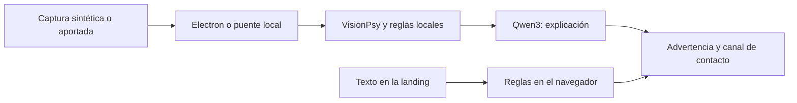

# Certiva · Tu aliado contra el fraude

**Antes de responder, verifica.** Certiva ayuda a reconocer señales de estafa en mensajes y capturas, explica el riesgo y orienta al usuario hacia un canal oficial. El alcance vigente es un SDK móvil y una consola para que un banco ofrezca esta protección a sus clientes. Caja de Ahorros es una referencia de producto; no existe integración bancaria, contrato ni aval institucional. USDT y wallets cripto quedan fuera del alcance comercial actual.

Proyecto del Hackatón QVAC · ISD Summit 2026. Tracks: **Desafío General**, **Caja de Ahorros** y **QVAC Psy**.

## Estado del avance

Corte documental: **10 de septiembre de 2026, hora de Panamá**. Las pruebas y limitaciones se declaran por componente; los benchmarks históricos no equivalen a una evaluación de esta versión.

| Componente | Disponible en este avance | Alcance y guía |
|---|---|---|
| Escritorio Electron | Teléfono simulado, mensaje → alerta → detalle, centro de seguridad y análisis QVAC local | [Recorrido y pruebas](docs/EXPERIENCIA-Y-ALERTAS.md) · [Entorno QVAC](docs/INTERFAZ-LOCAL.md). Las medidas bancarias son solicitudes de demostración. |
| Landing | Sitio interactivo, verificador de texto por reglas y puente opcional al QVAC del propio equipo | [Web publicada](https://certiva-landing.vercel.app) · [Instalación y límites](landing/README.md). QVAC no se ejecuta en Vercel. |
| Piloto bancario | SDK de reglas compartido, cliente/consola web, API SQLite y SDK/apps de muestra iOS y Android | [Guía del piloto](pilot/README.md) · [Oferta de evaluación](pilot/OFERTA-PILOTO.md). Sin QVAC móvil ni conexión a APIs bancarias. |
| Exploración Expo | Andamiaje previo en `mobile/`, conservado desde `main` | No acredita QVAC funcionando en un teléfono. [Guía](mobile/README.md) |
| Marca | Nombre, descriptor, azul `#205094` y referencia v5 aprobados | [Memoria](MEMORIA_PROYECTO.md) · [Referencia visual](docs/marketing/brand/certiva-aplicaciones-azul-v5.png) |

La app de escritorio ejecuta VisionPsy, reglas y Qwen3 localmente. La landing analiza texto con reglas en el navegador; para usar modelos requiere un puente en `127.0.0.1` y modelos descargados en el mismo equipo. Las alertas y el consejo no autentican remitentes ni garantizan que un mensaje sea legítimo.



## Inicio rápido

Escritorio, desde la raíz, con Node 22.17+:

```sh
npm ci
npm run modelos
npm start
```

Landing sin dependencias adicionales:

```sh
cd landing
npm test
npm run build
npm run dev
```

Vista local: `http://127.0.0.1:4317`. Para conectar QVAC, seguir [landing/README.md](landing/README.md). El worker QVAC se comparte: coordinar su uso antes de iniciar Electron, el puente o una evaluación. No ejecutar dos inferencias del proyecto en procesos distintos al mismo tiempo.

## Validación de este avance

- `npm test`: **11/11** pruebas del motor, evaluación y persistencia/transiciones de casos, con dobles de los modelos.
- `npx electron scripts/prueba-experiencia.js`: **9/9** comprobaciones de navegación y reporte con motor controlado; ver entorno utilizado en [la guía del portal](docs/EXPERIENCIA-Y-ALERTAS.md).
- `node eval/reglas-check.js`: **136/136** veredictos correctos sobre el texto verdadero del dataset sintético; no mide OCR ni generalización.
- `npm --prefix landing test`: **7/7**, con reglas y contrato HTTP del puente.
- `npm --prefix landing run build`: genera el sitio estático.
- Sintaxis de JavaScript del portal y Biome de ocho archivos modificados: sin errores, con 12 advertencias.

La verificación QVAC real previa está descrita en las guías de escritorio y landing. No se repitió al preparar este PR para evitar interferir con el motor en uso. La conexión de la landing desde un navegador depende de sus permisos de red local y no está validada por las pruebas HTTP.

## Piloto bancario: SDK móvil y consola

El recorrido de evaluación es **verificar mensaje → confirmar reporte → revisar caso → resolver**. El SDK procesa texto localmente; iOS puede leer una captura con Apple Vision y exige confirmar la lectura. Android incluye app de muestra y biblioteca AAR para pegar o compartir texto. La versión base pasó las pruebas nativas de motor y conexión; falta repetirlas con el APK de esta rama. Estas aplicaciones no ejecutan QVAC.

La consola usa sesiones y roles de cliente, analista y auditor, aislamiento por banco, deduplicación, control de versiones y auditoría en SQLite. El reporte contiene nueve campos de resultado y consentimiento; no incluye el mensaje, la captura, enlaces ni teléfonos. Son reportes de clientes pendientes de corroboración.

```sh
# Desde la raíz, con Node 22.17+:
npm --prefix pilot test
npm --prefix pilot start
# Consola: http://127.0.0.1:4320
swift test --package-path pilot/ios
```

Los accesos locales se generan al primer arranque y se guardan fuera del repositorio; el servidor imprime la ubicación del archivo privado. La instalación iOS, la compilación Android y el alcance del SDK están en [pilot/README.md](pilot/README.md). Las claves públicas y la política de desarrollo firmada se incluyen; la clave privada no se publica. La política vence el 10 de diciembre de 2026.

**Validación de integración:** 15 pruebas Node y 6 pruebas Swift, incluyendo OCR real de una captura sintética y señales de pago que deben conservar el mismo resultado en la fuente, los bundles web/nativos y los reportes aceptados por la API. También compiló la app iOS para simulador desde esta rama. La prueba del bundle Android en Node comprueba paridad de reglas; la versión base pasó 2/2 pruebas nativas, pero falta repetirlas en el APK integrado ([evidencia](pilot/VALIDACION.md)). El proyecto Gradle compiló APK, APK de pruebas y AAR; lint registró 0 errores y 13 advertencias. Las pruebas instrumentadas están incluidas para repetir la comprobación nativa pendiente.

El piloto es para evaluación interna. Autenticación institucional, despliegue con TLS, operación bancaria y pruebas en teléfonos físicos siguen pendientes; ver los criterios de adopción de la guía. La propuesta comercial y los precios siguen por validar.

## Trabajo por commits y PRs

Cada entrega debe partir de `origin/main` actualizado, agrupar cambios coherentes en commits y actualizar este README junto con la guía del componente. El PR debe indicar las pruebas realizadas y los pendientes. Los cambios en desarrollo de otras tareas se incorporan cuando estén estables; no se cambian de rama ni se sobrescriben sus archivos compartidos.

Los resultados locales de pruebas, credenciales, bases de datos, modelos, APK/AAR compilados y archivos temporales no son código fuente. Los artefactos se entregan por separado y las afirmaciones de validación deben identificar el entorno donde se comprobaron.

## Base preexistente

Declaración obligatoria del hackatón. Este proyecto parte de código ajeno:

- **Andamiaje de Electron, puente IPC, catálogo de modelos y patrón de extracción con esquema JSON** tomados de `qvac-invoice-manager-demo` en [tetherto/qvac-examples](https://github.com/tetherto/qvac-examples), licencia Apache-2.0, © QVAC by Tether. Archivos derivados: `main.js`, `preload.js`, `lib/modelos.js`, `lib/analizar.js`. Se recortaron y adaptaron; el texto original de la licencia está en `vendor-notice/`.
- **Patrones consultados** en `qvac-voice-relay` (transcripción) y `qvac-desk-tidy-demo` (embeddings) del mismo repositorio.
- Todo lo demás se escribió durante el hackatón: reglas, esquemas, generador de datos sintéticos, evaluación, pares, interfaz.

## Modelos y hardware declarados

| Tarea | Modelo | Constante del SDK | Cuantización |
|---|---|---|---|
| Leer la captura | VisionPsy Nano 460M Flash (modelo Psy) | `VISIONPSY_NANO_460M_MULTIMODAL_Q8_0` + proyector | Q8_0 |
| Veredicto y explicación | Qwen3 4B Instruct | `QWEN3_4B_INST_Q4_K_M` | Q4_K_M |
| Transcripción de llamadas | Parakeet TDT 0.6B v3 | `PARAKEET_TDT_0_6B_V3_Q8_0` | Q8_0 |
| Embeddings del RAG | EmbeddingGemma 300M | `EMBEDDINGGEMMA_300M_Q4_0` | Q4_0 |

Hardware de los benchmarks históricos: MacBook con Apple M4 y 16 GB de RAM, macOS, backend GPU. SDK `@qvac/sdk` 0.19. Tiempos medidos en esta máquina: VisionPsy 1,06 s al primer token y 168 tokens/s; Qwen3 4B 2,33 s al primer token y 34 tokens/s con la política en el prompt. El objetivo del producto es el teléfono del cliente; los benchmarks de VisionPsy en teléfonos citados en la presentación son del fabricante del modelo, no medidos por este equipo **(pendiente: medición de QVAC en teléfonos físicos)**. La comprobación reciente de escritorio usa un Apple M1 Pro de 16 GB; ver [INTERFAZ-LOCAL.md](docs/INTERFAZ-LOCAL.md).

## Reproducir

```bash
node -v                    # 22.17 o más
npx -y @qvac/cli doctor    # GPU, memoria, disco
npm install
node node_modules/electron/install.js   # si npm install no bajó el binario de Electron (pasa en redes lentas)
npm run modelos            # descarga los modelos a ~/.qvac/models (una vez, con internet)
npm run datos              # genera los mensajes sintéticos y renderiza las capturas
npm run prueba             # apaga el Wi-Fi primero: captura -> VisionPsy -> reglas -> veredicto de Qwen3
node scripts/prueba-llamada.js   # modo llamada sin interfaz sobre el audio sintético
npm run lint               # Biome
npm start                  # la app
npm run eval               # métricas sobre el set sintético -> eval/results.md
node eval/reglas-check.js  # chequeo de las reglas sin modelos
```

Después de descargar los modelos, la inferencia puede funcionar sin internet; P2P requiere conectividad entre equipos. La evaluación nueva guarda el rendimiento dentro del directorio de su corrida.

## Cómo funciona

1. **VisionPsy transcribe la captura** (`lib/analizar.js`, `extraerConVision`). Es el único modelo que mira la imagen. Se le pide una transcripción libre, línea por línea, que es lo que hace bien; no se le pide que rellene un esquema.
2. **Reglas deterministas derivan los campos** de esa transcripción (`lib/lector.js`, `derivar`): canal, remitente, enlaces, teléfonos y montos por expresiones regulares y posición, con reparación de enlaces partidos por el salto de línea.
3. **Reglas de fraude** (`lib/reglas.js`) producen evidencias en texto: dominio parecido al oficial, acortador, IP literal, punycode, número no oficial, petición de clave o código, presión de tiempo, pago a terceros. La presión de tiempo y la petición de datos se buscan sin tildes y tolerando una letra cambiada o de menos, porque VisionPsy transcribe «último aviso» o «dígame el código» con errores; un «no» o «nunca» delante del verbo anula la petición, para que «no lo comparta con nadie» siga siendo un consejo.
   **Segunda lectura con OCR**: cuando VisionPsy no encuentra señales, la misma imagen se lee con el OCR determinista; el OCR solo puede sumar señales de frase, petición de datos, urgencia o pagos, nunca de dominio ni de número, porque ensucia enlaces y convertía correos oficiales en fraude. Si VisionPsy leyó casi nada o las dos lecturas no coinciden en nada, el veredicto es «no legible» en vez de tranquilizar.
   **Contraste con OCR** (`Motor.contrastar`): solo en correos, y solo cuando una regla marca un dominio parecido al oficial, la misma imagen se lee con el OCR determinista del SDK (latin_g2 + CRAFT). Si el OCR ve el dominio oficial exacto y no ve el parecido, el fallo era de transcripción: el enlace se corrige y la señal desaparece. Si el OCR también ve el parecido, la señal se mantiene. Cuesta entre 7 y 9 s en un correo largo, por eso no corre en cada mensaje.
4. **Qwen3 4B** recibe la extracción y las evidencias y redacta el veredicto con un esquema JSON obligatorio: fraude, sospechoso, sin señales o no legible, con confianza, señales, acción y canal oficial. Nunca dice «seguro».
5. **Modo llamada** (`lib/llamada.js`). El audio se transcribe en el equipo por lotes de cinco segundos con **Parakeet TDT 0.6B v3**, y reglas deterministas sobre la ventana de los últimos veinte segundos disparan el aviso en el instante en que aparece una señal: pide el código, pide la clave, presiona con el tiempo, se presenta como el banco, pide un pago. El aviso llega con un mensaje fijo para el cliente, sin esperar a ningún modelo. Al terminar, Qwen3 4B resume la llamada en dos frases con un esquema JSON. En la app, la transcripción se muestra sincronizada con la reproducción del audio, así que se ve como en vivo aunque se procese por lotes.
6. **Política del banco como contexto** (`lib/politica.js`). La política anti-fraude sintética se parte en fragmentos y se indexa en el vector store del SDK con **EmbeddingGemma 300M**; en cada veredicto y en cada resumen de llamada se recuperan los tres fragmentos más cercanos y entran al prompt de Qwen3, que los usa para la acción y el canal oficial. Indexar cuesta unos 2 s la primera vez y cada búsqueda unos 10 ms.
7. **Pares** (`lib/pares.js`, `scripts/pares-worker.js`). Cuando un cliente reporta, solo viaja el hash del remitente, del número o del dominio, con el tipo y la hora. La capa de pares corre en un proceso hijo con **Hyperswarm**, el enjambre de Pear, sobre un tema fijo, y tiene un modo directo por TCP para redes que bloquean el DHT. Cada nodo conserva qué otros nodos reportaron cada indicador: si otro cliente ya reportó el mismo dominio o número, el teléfono lo dice antes del consejo. El radar del banco recibe lo mismo y lo muestra por hora. Como el proceso de pares es hijo aparte, el contador de la barra separa «nube» de «pares» con `lsof`: en la demo, nube cero.

### La decisión sobre el lector, con evidencia

Se probaron tres lectores sobre las mismas capturas sintéticas (`scripts/experimento-*.js`, `scripts/prueba-vision.js`, `scripts/prueba-lector.js`):

| Lector | Qué pasó | Tiempo por captura en el M4 |
|---|---|---|
| VisionPsy Flash con esquema JSON de ocho campos | Respeta la forma pero inventa el contenido: listas de enlaces con basura, «pide datos» casi siempre en true, texto parcial | 2 a 4 s |
| VisionPsy Flash en transcripción libre + reglas | Transcripción casi literal, remitentes y enlaces correctos, 15 de 15 veredictos por reglas en la muestra | TTFT 1,3 s · total 1,8 s |
| OCR clásico del SDK (latin_g2 + CRAFT) + reglas | Texto casi literal pero ensucia los enlaces («https:Il», «comlverificar») y tarda demasiado | 15 a 18 s |

Se eligió VisionPsy en transcripción libre. El OCR y la variante con esquema quedan disponibles con `LECTOR=ocr` y `LECTOR=visionpsy-esquema` para reproducir la comparación con `npm run eval`.

Una trampa que costó una hora y conviene contar: Electron recuerda el zoom por origen entre ejecuciones, y la segunda renderización de las capturas salió cortada por la mitad a la derecha. Los dos lectores «perdían el final de cada línea» y parecía culpa de los modelos. `data/render.js` fija el zoom en 1.

## Interfaz

La experiencia del cliente empieza fuera de Certiva, en una pantalla Android simulada: cámara circular, reloj, fondo local e iconos SVG. Las notificaciones y el detalle de Certiva mantienen esa apariencia Android. Elegir un ejemplo entrega el mensaje, solicita el análisis y muestra una alerta; tocarla abre las señales y el consejo. El usuario decide si reporta. El detalle técnico conserva los pasos, tiempos y resultado del motor.

El **Centro de seguridad** conserva casos locales de demostración, asignación, solicitudes de medidas y cierre con historial. No autentica analistas ni ejecuta cambios de claves, cierre de sesiones o comunicaciones bancarias. Los reportes de la APK se abren en la consola autenticada del piloto en el puerto 4320; su almacén y permisos son independientes. Ver [recorrido, límites y comprobaciones](docs/EXPERIENCIA-Y-ALERTAS.md).

## Cómo probarlo tú mismo

La guía completa, con solución de problemas, está en [docs/COMO-PROBAR.md](docs/COMO-PROBAR.md).

Todo corre en el MacBook. Dos procesos de QVAC a la vez se bloquean en el worker compartido, así que cierra cualquier script del proyecto antes de abrir la app, y al revés.

1. **Preparar una vez**, con internet: `npm install`, `node node_modules/electron/install.js` si no bajó Electron, y `npm run modelos`. Si el registro P2P del SDK se cae a mitad de Qwen3 4B, `node scripts/importar-modelo.js QWEN3_4B_INST_Q4_K_M <archivo .gguf bajado por HTTP>` lo importa validando el checksum.
2. **Datos de la demo:** `npm run datos` genera los 136 mensajes y sus capturas del dataset actual; `node data/generar-llamada.js` genera el audio de la llamada con las voces del sistema.
3. **Sin interfaz, para ver el motor:** `npm run prueba` analiza una captura de punta a punta; `node scripts/prueba-llamada.js` corre la llamada; `node scripts/prueba-politica.js` muestra qué recupera el RAG; `npm run eval` evalúa el dataset actual y guarda los resultados de la corrida; `eval/results.md` conserva resultados históricos.
4. **La app:** apaga el Wi-Fi y `npm start`. Pestaña Cliente: toca una tarjeta de ejemplo, o arrastra una captura, y mira el teléfono. «Simular llamada de vishing» reproduce el audio con la transcripción sincronizada y el «Cuelga». «Reportar este mensaje» publica el hash a los pares. Pestaña Modo banco: el radar. La barra dice cuántas conexiones hay a la nube y cuántas a pares.
5. **Pares en dos máquinas:** en la segunda, `node scripts/radar.js` se une al enjambre y va listando lo que llega. Si la red del lugar bloquea el DHT, modo directo: en la segunda máquina `node scripts/radar.js --puerto 4411 --sin-swarm`, y en la primera `PARES_DIRECTO=<ip de la segunda>:4411 npm start`. Para probarlo solo, en una terminal `node scripts/radar.js --puerto 4411 --sin-swarm --emitir dominio:bancodemo-pa.app` y en otra `PARES_DIRECTO=127.0.0.1:4411 PARES_SWARM=0 npm start`: al analizar la tarjeta «SMS: cuenta bloqueada» el teléfono dice que otro cliente ya reportó esa dirección.
6. **Comprobar sin manos:** `DEMO_AUTO=fraude-bloqueo_enlace-01 DEMO_CAPTURA=/tmp/app.png DEMO_SALIR=1 DEMO_ESPERA_MS=26000 npx electron .` analiza esa captura al abrir y guarda una imagen de la ventana; `DEMO_LLAMADA=1` hace lo mismo con la llamada.

Variables útiles: `LECTOR=ocr` o `LECTOR=visionpsy-esquema` cambian el lector para la comparación; `SIN_RAG=1` apaga la política; `PARES=0` apaga la capa de pares; `PARES_SWARM=0` deja solo el modo directo; `PARES_PUERTO=4411` hace que la app también escuche directo.

## Exploración móvil previa

El andamiaje Expo de `mobile/` y [su plan de APK](docs/PLAN-APK.md) se conservan desde `main`. Plantean descargar modelos por separado del APK, pero no acreditan compilación ni inferencia QVAC en teléfonos. Esta exploración es distinta del SDK y la consola del [piloto bancario](pilot/README.md), que usan reglas locales y OCR Apple Vision en iOS.

## Datos

Ningún dato real. El emisor de la demo es «Banco Demo»; las estafas de billetera imitan a «Billetera Demo», también ficticia. El audio de la llamada de vishing de la demo, `data/audio/llamada-vishing.wav`, es sintético: lo genera `data/generar-llamada.js` con las voces del sistema de macOS a partir del guion de `data/llamada-vishing.md`. Nadie fue grabado. Medido en el M4: cada lote de cinco segundos se transcribe en unos 150 ms, y la llamada completa de 45 s se procesa en unos 10 s con carga del modelo incluida. `data/banco-demo.json` define un banco ficticio con sus canales oficiales y los dominios parecidos que las reglas deben atrapar. `data/generar.js` produce mensajes de fraude y legítimos en español panameño con verdad conocida, y `data/render.js` los renderiza como capturas de SMS, WhatsApp y correo. Para un banco real se reemplaza el archivo del banco.

## Para el jurado de la Caja de Ahorros

**Aplicabilidad.** Es una función para la app del banco, no un producto aparte: «Verificar un mensaje» y «Verificar una llamada» dentro de la app que el cliente ya tiene. El mismo motor sirve en modo sucursal, para el cajero que recibe «¿este correo es de ustedes?». El radar le da al equipo de fraude las campañas contra la marca a medida que aparecen, con solo hashes.

**Lo local como ventaja, no como restricción.** Los mensajes y las llamadas privadas del cliente nunca llegan al banco ni a un proveedor, así que el banco no se vuelve custodio de datos que no quiere tener. El costo de inferencia por verificación es cero a cualquier escala. Funciona sin plan de datos, que es la realidad de muchos clientes. Y la trazabilidad que pide el regulador sale de los reportes, no de los mensajes.

**Demostración.** Cuatro ejemplos con un clic, la simulación de llamada con el aviso «Cuelga», el reporte que llega a otro equipo por pares, y el contador de conexiones a la nube en cero durante toda la demo.

**Piloto propuesto.** Noventa días con el equipo de fraude y un grupo de clientes, midiendo tres cosas: mensajes verificados, campañas detectadas antes que el centro de llamadas, y llamadas al centro evitadas.

## Para el reto QVAC Psy

**Por qué VisionPsy es central por necesidad.** La captura de pantalla permite al usuario aportar mensajes de distintas aplicaciones sin integrar cada servicio, y leerla en el teléfono exige un modelo de visión que quepa en un teléfono de gama media. VisionPsy Nano 460M Flash es el único modelo que mira la imagen en este flujo.

**Resultados históricos anteriores a la segunda lectura; deben repetirse para esta rama. Calidad medida sobre el set sintético** (`npm run eval`; la corrida reportada usó 120 capturas, y las 16 de billetera agregadas después entran en la próxima; resultados completos en `eval/results.md`, registro por llamada en `eval/perf.jsonl`):

| Métrica | Valor |
|---|---|
| Exactitud global del veredicto | 98,3% |
| Precisión en fraude | 100,0% |
| Exhaustividad en fraude | 96,9% |
| Legítimos reconocidos sin señales | 100,0% (48/48) |
| Mensajes con solo presión de tiempo reconocidos como sospechosos | 100,0% (8/8) |
| Remitente correcto (VisionPsy) | 85,8% |
| Dominios de los enlaces correctos (VisionPsy, tras el contraste) | 85,0% |
| Teléfonos correctos (VisionPsy) | 95,0% |
| Texto literal, 1 − CER medio (VisionPsy) | 73,9% |

| Etapa | TTFT mediana | Total mediana | Tokens/s | Tokens de salida |
|---|---|---|---|---|
| VisionPsy Flash, transcripción | 1,06 s | 1,81 s | 168 | 94 |
| Búsqueda en la política (EmbeddingGemma, vector store del SDK) | — | 29 ms | — | — |
| Contraste con OCR, solo en correos con dominio parecido (11 de 120) | — | 7,6 s | — | — |
| Qwen3 4B, veredicto con esquema y política | 2,33 s | 5,46 s | 34 | 102 |

Hardware: MacBook con Apple M4, 16 GB, backend GPU (Metal), `@qvac/sdk` 0.19. Cero errores de ejecución en las 120 capturas. Las corridas anteriores están en el historial del repositorio: 92,5 % con las reglas iniciales; 95,8 % con urgencia tolerante y política; 97,5 % con el contraste OCR; esta, con la petición de datos tolerante. La transcripción de VisionPsy no es determinista entre corridas, así que las cifras de extracción se mueven un par de puntos de una corrida a otra.

**Verificación del 10 de septiembre a las 23:00, tras corregir la segunda lectura OCR.** La corrida completa con la segunda lectura original dio 83,1 % de exactitud: los 80 fraudes bien y 23 legítimos mal, porque el OCR podía agregar señales de dominio y ensucia los enlaces. Con la segunda lectura asimétrica, que solo suma señales de frase y abstiene con 0,3 de acuerdo, los 56 legítimos dieron 53 de 56 (`eval/runs/2026-09-11T03-45-52-660Z`): quedan un «último aviso» que sube a fraude en vez de sospechoso, un recordatorio de pago y un WhatsApp oficial que se abstiene. La corrida completa de 136 con la corrección queda pendiente por tiempo. En la corrida previa, 4 de los 80 fraudes se detectaron gracias a una señal de número que la segunda lectura ya no puede aportar; re-ejecutados con la corrección, esos 4 salen «no legible», es decir, el motor se abstiene en vez de tranquilizar. Estimación combinada del estado actual: fraudes 76 de 80 detectados y 4 abstenciones, ningún fraude mostrado como «sin señales»; legítimos 53 de 56; exactitud global cercana al 95 %.

**Límites y manejo de riesgo, con honestidad.**
- La transcripción de VisionPsy tiene errores de caracteres (CER medio del 26,1 %), pero los campos que deciden el veredicto sobreviven porque las reglas trabajan sobre dominios, números y frases clave con tolerancia a errores, y porque un dominio dudoso en un correo se contrasta con el OCR determinista.
- Fallos de esta corrida, 2 de 120: fraude-pide_codigo-03: esperado fraude, obtenido sin_senales; fraude-pide_codigo-05: esperado fraude, obtenido sin_senales. Son mensajes que solo piden el código, sin enlace ni número, en los que la transcripción perdió a la vez el verbo y el dato; ningún legítimo se marcó como fraude. Ahí el techo lo pone la calidad de la transcripción, no las reglas.
- La app nunca dice «seguro». Ante la duda, muestra el canal oficial y pide llamar al número impreso en la tarjeta.

## Para el desafío general

**Problema.** Según los reportes de los bancos a la Superintendencia de Bancos de Panamá, en 2025 hubo intentos de fraude por canales electrónicos por unos 150 millones de dólares y fraudes materializados por unos 21 millones; el sector habla de siete panameños estafados al día, y el regulador alertó sobre esquemas que usan el nombre y el logo de los bancos. La víctima típica es una persona mayor con un mensaje o una llamada que la presiona.

**Por qué en el dispositivo.** La nube no debería llegar a los mensajes privados de nadie. La captura de pantalla es una entrada compartida para mensajes de distintas apps, y leerla exige un modelo de visión que quepa en un teléfono: VisionPsy Nano 460M. Todo lo demás, reglas, veredicto, transcripción de llamadas y política del banco, corre en el mismo equipo.

**Innovación.** El prototipo simula alertas durante una llamada procesada por lotes. Comparte indicadores reportados entre pares mediante Hyperswarm; su autenticidad requiere revisión y no demuestra inmunidad colectiva.

**Evidencia.** Evaluación reproducible sobre 120 capturas sintéticas con verdad conocida, registro de rendimiento por llamada al modelo, y una comparación honesta de tres lectores que dejó a VisionPsy transcribiendo y a las reglas derivando los campos.

## Seguridad y límites

- La app nunca dice «seguro». Dice «no encontré señales» y repite que el banco nunca pide claves ni códigos.
- La demo corre en escritorio. Los reportes transmiten hashes de indicadores, tipo, hora e identificador de nodo; no el mensaje. La interfaz y los registros locales deben revisarse antes de usar datos reales.
- Puede fallar con tácticas nuevas. Ante la duda, llamar al número oficial impreso en la tarjeta.

## Modelo de negocio

La propuesta vigente es [Certiva para banca: producto y modelo comercial](docs/PRODUCTO-BANCA-Y-MODELO-COMERCIAL.md): SDK integrado en la app del banco, protección esencial incluida para el cliente y consola para gestionar los reportes. El banco contrataría integración y licencia por bandas de clientes activos; el piloto, los precios y la modalidad de cobro son hipótesis por validar.

Los documentos de [propósito e integración](docs/PROPOSITO-E-INTEGRACION.md) y [banca/USDT](docs/PRODUCTO-PRODUCCION-PANAMA-USDT.md) conservan contexto histórico. Las propuestas de cripto, intervención sobre pagos e integración institucional no describen funcionalidades entregadas ni requisitos vigentes. El dataset heredado incluye 16 ejemplos sintéticos de billetera como casos de regresión; conservarlos no amplía el alcance del producto.

## Licencia

Apache-2.0. Ver `LICENSE` y `NOTICE`.

## Cambios de fiabilidad y alcance de la demo

La ausencia de señales en VisionPsy activa una segunda lectura OCR local. La segunda lectura solo suma señales de frase permitidas; no agrega dominios ni números derivados del OCR. Si recupera una señal permitida se usa para el veredicto; si falla, el texto es demasiado corto o los lectores discrepan, se pide revisión con `no_legible`. El generador no puede rebajar una alerta determinista. El umbral es heurístico, no una garantía: dos lectores pueden omitir la misma frase. Se añade latencia y debe medirse de nuevo.

`npm test` verifica estos flujos con dobles de los modelos. No sustituye la evaluación real. Ver [protocolo externo](docs/EVALUACION-INDEPENDIENTE.md) y [guion de entrega](docs/guion-video.md).

El radar marca reportes para investigación durante la sesión; no confirma fraude, no acredita usuarios únicos y no bloquea clientes. Los hashes sin secreto pueden compararse por enumeración y no son anonimización. El transporte directo TCP es únicamente para demostración con datos sintéticos en una red de confianza. El contador muestra conexiones TCP observadas, excluye UDP y no demuestra ausencia total de tráfico. Un fallo de medición se muestra como no disponible.
