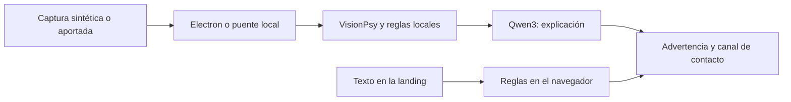

# Certiva · Tu aliado contra el fraude

**Antes de responder, verifica.** Certiva ayuda a reconocer señales de estafa en mensajes y capturas, explica el riesgo y orienta al usuario hacia un canal oficial. El alcance vigente es un SDK móvil y una consola para que un banco ofrezca esta protección a sus clientes. Caja de Ahorros es una referencia de producto; no existe integración bancaria, contrato ni aval institucional. USDT y wallets cripto quedan fuera del alcance comercial actual.

Proyecto del Hackatón QVAC · ISD Summit 2026. Tracks: **Desafío General**, **Caja de Ahorros** y **QVAC Psy**.

Demo vigente: [Android y administración del mismo caso — video de 56 segundos y proyecto editable](docs/marketing/video/ENTREGA-DEMO-FINAL.md). Usa reglas locales; documenta por separado el fallo de instrumentación administrativa y la verificación independiente del caso.

## Estado del avance

Android0.5 conecta **Ingresar/Mis reportes por HTTPS** y permite borrar reportes propios: [PR #37](https://github.com/Andresssrr24/certiva/pull/37). [Servicio y validación](landing/REPORTS-SETUP.md): dos pruebas nativas contra HTTPS aprobadas en emulador API35; no acredita instalación física desde Play ni inferencia QVAC. Las correcciones de cuota de la revisión están publicadas en código y pendientes de desplegar.

Corte documental: **11 de septiembre de 2026, hora de Panamá**. Los [avances de todas las tareas](docs/AVANCES-HILOS-20260911.md) reúnen código, pruebas, documentación, videos e investigación, con sus PRs y artefactos. El inventario actualizado distingue PR integradas, las PR #34/#35/#36/#37 abiertas y los 22 archivos de la prerelease, con sus hashes. API36 requiere integrar la PR #36 en `main`; su PR anterior se fusionó en otra rama. Las pruebas y limitaciones se declaran por componente; los benchmarks históricos no equivalen a una evaluación de esta versión.

| Componente | Disponible en este avance | Alcance y guía |
|---|---|---|
| Escritorio Electron | Teléfono simulado, mensaje → alerta → detalle, centro de seguridad y análisis QVAC local | [Recorrido y pruebas](docs/EXPERIENCIA-Y-ALERTAS.md) · [Entorno QVAC](docs/INTERFAZ-LOCAL.md). Las medidas bancarias son solicitudes de demostración. |
| Landing | Teléfono Android interactivo con notificaciones y detalle, favicon Certiva, guía de cinco pasos y QR de descarga Android; puente QVAC opcional del propio equipo | [Web publicada](https://certiva-landing.vercel.app) · [Instalación y límites](landing/README.md). La APK 0.3 descargable es experimental; QVAC web no se ejecuta en Vercel. |
| Piloto bancario | SDK de reglas compartido, cliente/consola web, API SQLite y SDK/apps de muestra iOS y Android | [Guía del piloto](pilot/README.md) · [Oferta de evaluación](pilot/OFERTA-PILOTO.md). Android 0.2 usa reglas; sin conexión a APIs bancarias. |
| Android nativo 0.4 experimental | Inicio y menú en cuatro secciones, runtime QVAC CPU, instalador de modelo y conservación del riesgo de reglas cuando falla la IA | [Código y construcción](pilot/android-qvac/README.md) · [Resultados y fallos](pilot/android-qvac/VALIDATION.md). El clasificador corregido agotó el tiempo en Android; no es una versión validada. |
| App Android con QVAC (Expo) | [APK actual de 229 MB](https://github.com/Andresssrr24/certiva/releases/tag/apk-v0.2) compilado y probado en emulador arm64: texto por reglas en 1 ms; VisionPsy Q8 se descarga desde la app y leyó capturas en CPU (31 a 43 s); desde el 11 de septiembre es una app con cuatro pestañas (revisar, historial, aprender, ajustes), marca Certiva e historial en el teléfono (0.3.0, publicada en la release apk-v0.2) | [Guía](mobile/README.md) · [Plan y mediciones](docs/PLAN-APK.md). Pendiente: prueba en teléfono físico con GPU |
| Marca | Nombre, descriptor, azul `#205094` y referencia v5 aprobados | [Memoria](MEMORIA_PROYECTO.md) · [Referencia visual](docs/marketing/brand/certiva-aplicaciones-azul-v5.png) |

Registro beta: **habilitado con Google; descarga cerrada pendiente**. Confirma la cuenta y su membresía en el grupo con consentimiento. `BETA_ENABLED=true` permite registrarse; `BETA_PLAY_READY=false` mantiene oculto el enlace de instalación. Con la prueba cerrada disponible y la bandera activada, el registro confirmado redirigirá directamente a Google Play. La tarea de landing verificó OAuth completo en Chrome de escritorio con una cuenta ya perteneciente al grupo, tras corregir el fallo de origen del formulario. Bryan confirmó después que el registro en Android funciona. Siguen pendientes una nueva alta externa instrumentada y la distribución cerrada. [Configuración y estado](landing/BETA-SETUP.md) · [Revisión de integración](landing/BETA-REVIEW.md). Google Play lleva 6 de 11 tareas completas; la ficha es-419 está en borrador. [Política Android](https://certiva-landing.vercel.app/privacidad-app) · [Materiales y pendientes](landing/play-store-assets/README.md).

Distribución del piloto nativo: [diagnóstico de Play Protect y borrador de revisión](docs/android/PLAY-PROTECT-REVISION.md). El bloqueo reportado no está resuelto; la preparación de Google Play continúa por separado. Este diagnóstico corresponde a `local.certiva.pilot`, distinto de la app Expo de la tabla.

La app de escritorio ejecuta VisionPsy, reglas y Qwen3 localmente. La landing analiza texto con reglas en el navegador; para usar modelos requiere un puente en `127.0.0.1` y modelos descargados en el mismo equipo. Las alertas y el consejo no autentican remitentes ni garantizan que un mensaje sea legítimo.



## Inicio rápido

Escritorio, desde la raíz, con Node 22.17+:

```sh
npm ci
npm run modelos
npm start
```

Landing: antes de construir desde un clon, descarga el APK congelado siguiendo [las instrucciones de reconstrucción](landing/README.md#reconstruir-desde-un-clon). El build comprueba su tamaño y SHA-256. Después:

```sh
cd landing
npm ci
npm test
npm run build
npm run dev
```

Vista local: `http://127.0.0.1:4317`. Para conectar QVAC, seguir [landing/README.md](landing/README.md). El worker QVAC se comparte: coordinar su uso antes de iniciar Electron, el puente o una evaluación. No ejecutar dos inferencias del proyecto en procesos distintos al mismo tiempo.

## Validación de este avance

- `npm test`: **11/11** pruebas del motor, evaluación y persistencia/transiciones de casos, con dobles de los modelos.
- `npx electron scripts/prueba-experiencia.js`: **9/9** comprobaciones de navegación y reporte con motor controlado; ver entorno utilizado en [la guía del portal](docs/EXPERIENCIA-Y-ALERTAS.md).
- `node eval/reglas-check.js`: **136/136** veredictos correctos sobre el texto verdadero del dataset sintético; no mide OCR ni generalización.
- `npm --prefix landing test`: **30/30**, con reglas, puente, registro Google, reportes por cuenta, cuota persistente y aprovisionamiento privado; servicios externos simulados en la suite.
- `npm --prefix landing run build`: genera el sitio estático.
- Sintaxis de JavaScript del portal y Biome de ocho archivos modificados: sin errores, con 12 advertencias.

La verificación QVAC real previa está descrita en las guías de escritorio y landing. No se repitió al preparar este PR para evitar interferir con el motor en uso. La conexión de la landing desde un navegador depende de sus permisos de red local y no está validada por las pruebas HTTP.

## Piloto bancario: SDK móvil y consola

La interfaz Android 0.4 incorpora **Inicio, Verificar, Alertas y Menú**, apertura con la marca aprobada, progreso de configuración y accesos a reportes, guía y privacidad. Conserva el borrador al navegar y abre los mensajes compartidos directamente en Verificar. [Comportamiento y comprobaciones](docs/ANDROID-INICIO-Y-MENU.md). La validación de QVAC sigue pendiente.

El portal analiza directamente el texto de los escenarios y muestra una advertencia inicial de reglas mientras Qwen prepara la explicación; el reporte espera al resultado final. El directorio de contactos incluye fuentes oficiales y fecha de consulta, y evita presentar teléfonos generados por IA como canales verificados. [Rendimiento y comprobaciones](docs/RENDIMIENTO-PORTAL.md) · [Contactos y límites](docs/CONTACTOS-BANCARIOS.md).

La APK usa el símbolo de Certiva como icono adaptativo del lanzador, con fondo blanco y márgenes para las máscaras redonda y cuadrada de Android. Las notificaciones usan una adaptación monocroma del símbolo y el logo a color en la alerta ampliada. [Recursos de marca y verificación](docs/ICONO-ANDROID.md).

El recorrido de evaluación es **verificar mensaje → confirmar reporte → revisar caso → resolver**. El SDK procesa texto localmente; iOS puede leer una captura con Apple Vision y exige confirmar la lectura. Android 0.2 añade protección voluntaria de notificaciones de WhatsApp, aviso nativo y apertura de detalle/reporte, además de pegar o compartir texto. Todo el análisis de la versión 0.2 usa reglas locales. [Guía y límites](docs/ALERTAS-ANDROID.md). La fuente Android de esta rama avanza a **0.4 experimental** con QVAC y nueva navegación; conserva por separado la evidencia y los binarios 0.2. La compilación, los iconos y las pruebas de interfaz no acreditan inferencia Android correcta.

La consola usa sesiones y roles de cliente, analista y auditor, aislamiento por banco, deduplicación, control de versiones y auditoría en SQLite. El reporte contiene nueve campos de resultado y consentimiento; no incluye el mensaje, la captura, enlaces ni teléfonos. Son reportes de clientes pendientes de corroboración.

```sh
# Desde la raíz, con Node 22.17+:
npm --prefix pilot test
npm --prefix pilot start
# Consola: http://127.0.0.1:4320
swift test --package-path pilot/ios
```

Los accesos locales se generan al primer arranque y se guardan fuera del repositorio; el servidor imprime la ubicación del archivo privado. La instalación iOS, la compilación Android y el alcance del SDK están en [pilot/README.md](pilot/README.md). Las claves públicas y la política de desarrollo firmada se incluyen; la clave privada no se publica. La política vence el 10 de diciembre de 2026.

**Validación de integración:** 15 pruebas Node y 6 pruebas Swift, incluyendo OCR real de una captura sintética y señales de pago que deben conservar el mismo resultado en la fuente, los bundles web/nativos y los reportes aceptados por la API. También compiló la app iOS para simulador desde esta rama. La prueba del bundle Android en Node comprueba paridad de reglas; la versión base pasó 2/2 pruebas nativas, pero falta repetirlas en el APK integrado ([evidencia](pilot/VALIDACION.md)). El proyecto Gradle y las pruebas instrumentadas están incluidos. Para Android 0.2, el APK congelado pasó 7 pruebas nativas ejecutadas por clase; esas pruebas todavía deben repetirse sobre el APK recompilado con el SDK integrado ([evidencia 0.2](pilot/VALIDACION-ANDROID-0.2.md)).

El piloto es para evaluación interna. Autenticación institucional, despliegue con TLS, operación bancaria y pruebas en teléfonos físicos siguen pendientes; ver los criterios de adopción de la guía. La propuesta comercial y los precios siguen por validar.

## Trabajo por commits y PRs

Cada entrega debe partir de `origin/main` actualizado, agrupar cambios coherentes en commits y actualizar este README junto con la guía del componente. El PR debe indicar las pruebas realizadas y los pendientes. Los cambios en desarrollo de otras tareas se incorporan cuando estén estables; no se cambian de rama ni se sobrescriben sus archivos compartidos.

Los resultados locales de pruebas, credenciales, bases de datos, modelos, APK/AAR compilados y archivos temporales no son código fuente. Los artefactos se entregan por separado y las afirmaciones de validación deben identificar el entorno donde se comprobaron.

## Base preexistente

Declaración obligatoria del hackatón. Este proyecto parte de código ajeno:

- **Andamiaje de Electron, puente IPC, catálogo de modelos y patrón de extracción con esquema JSON** tomados de `qvac-invoice-manager-demo` en [tetherto/qvac-examples](https://github.com/tetherto/qvac-examples), licencia Apache-2.0, © QVAC by Tether. Archivos derivados: `main.js`, `preload.js`, `lib/modelos.js`, `lib/analizar.js`. Se recortaron y adaptaron; el texto original de la licencia está en `vendor-notice/`.
- **Patrones consultados** en `qvac-voice-relay` (transcripción) y `qvac-desk-tidy-demo` (embeddings) del mismo repositorio.
- Todo lo demás se escribió durante el hackatón: reglas, esquemas, generador de datos sintéticos, evaluación, pares, interfaz.

## Modelos y hardware declarados

| Tarea | Modelo | Constante del SDK | Cuantización |
|---|---|---|---|
| Leer la captura | VisionPsy Nano 460M Flash (modelo Psy) | `VISIONPSY_NANO_460M_MULTIMODAL_Q8_0` + proyector | Q8_0 |
| Veredicto y explicación | Qwen3 4B Instruct | `QWEN3_4B_INST_Q4_K_M` | Q4_K_M |
| Transcripción de llamadas | Parakeet TDT 0.6B v3 | `PARAKEET_TDT_0_6B_V3_Q8_0` | Q8_0 |
| Embeddings del RAG | EmbeddingGemma 300M | `EMBEDDINGGEMMA_300M_Q4_0` | Q4_0 |

Hardware de los benchmarks históricos: MacBook con Apple M4 y 16 GB de RAM, macOS, backend GPU. SDK `@qvac/sdk` 0.19. Tiempos medidos en esta máquina: VisionPsy 1,06 s al primer token y 168 tokens/s; Qwen3 4B 2,33 s al primer token y 34 tokens/s con la política en el prompt. El objetivo del producto es el teléfono del cliente; los benchmarks de VisionPsy en teléfonos citados en la presentación son del fabricante del modelo, no medidos por este equipo **(pendiente: medición de QVAC en teléfonos físicos)**. La comprobación reciente de escritorio usa un Apple M1 Pro de 16 GB; ver [INTERFAZ-LOCAL.md](docs/INTERFAZ-LOCAL.md).

## Reproducir

```bash
node -v                    # 22.17 o más
npx -y @qvac/cli doctor    # GPU, memoria, disco
npm install
node node_modules/electron/install.js   # si npm install no bajó el binario de Electron (pasa en redes lentas)
npm run modelos            # descarga los modelos a ~/.qvac/models (una vez, con internet)
npm run datos              # genera los mensajes sintéticos y renderiza las capturas
npm run prueba             # apaga el Wi-Fi primero: captura -> VisionPsy -> reglas -> veredicto de Qwen3
node scripts/prueba-llamada.js   # modo llamada sin interfaz sobre el audio sintético
npm run lint               # Biome
npm start                  # la app
npm run eval               # métricas sobre el set sintético -> eval/results.md
node eval/reglas-check.js  # chequeo de las reglas sin modelos
```

Después de descargar los modelos, la inferencia puede funcionar sin internet; P2P requiere conectividad entre equipos. La evaluación nueva guarda el rendimiento dentro del directorio de su corrida.

## Cómo funciona

1. **VisionPsy transcribe la captura** (`lib/analizar.js`, `extraerConVision`). Es el único modelo que mira la imagen. Se le pide una transcripción libre, línea por línea, que es lo que hace bien; no se le pide que rellene un esquema.
2. **Reglas deterministas derivan los campos** de esa transcripción (`lib/lector.js`, `derivar`): canal, remitente, enlaces, teléfonos y montos por expresiones regulares y posición, con reparación de enlaces partidos por el salto de línea.
3. **Reglas de fraude** (`lib/reglas.js`) producen evidencias en texto: dominio parecido al oficial, acortador, IP literal, punycode, número no oficial, petición de clave o código, presión de tiempo, pago a terceros. La presión de tiempo y la petición de datos se buscan sin tildes y tolerando una letra cambiada o de menos, porque VisionPsy transcribe «último aviso» o «dígame el código» con errores; un «no» o «nunca» delante del verbo anula la petición, para que «no lo comparta con nadie» siga siendo un consejo.
   **Segunda lectura con OCR**: cuando VisionPsy no encuentra señales, la misma imagen se lee con el OCR determinista; el OCR solo puede sumar señales de frase, petición de datos, urgencia o pagos, nunca de dominio ni de número, porque ensucia enlaces y convertía correos oficiales en fraude. Si VisionPsy leyó casi nada o las dos lecturas no coinciden en nada, el veredicto es «no legible» en vez de tranquilizar.
   **Contraste con OCR** (`Motor.contrastar`): solo en correos, y solo cuando una regla marca un dominio parecido al oficial, la misma imagen se lee con el OCR determinista del SDK (latin_g2 + CRAFT). Si el OCR ve el dominio oficial exacto y no ve el parecido, el fallo era de transcripción: el enlace se corrige y la señal desaparece. Si el OCR también ve el parecido, la señal se mantiene. Cuesta entre 7 y 9 s en un correo largo, por eso no corre en cada mensaje.
4. **Qwen3 4B** recibe la extracción y las evidencias y redacta el veredicto con un esquema JSON obligatorio: fraude, sospechoso, sin señales o no legible, con confianza, señales, acción y canal oficial. Nunca dice «seguro».
5. **Modo llamada** (`lib/llamada.js`). El audio se transcribe en el equipo por lotes de cinco segundos con **Parakeet TDT 0.6B v3**, y reglas deterministas sobre la ventana de los últimos veinte segundos disparan el aviso en el instante en que aparece una señal: pide el código, pide la clave, presiona con el tiempo, se presenta como el banco, pide un pago. El aviso llega con un mensaje fijo para el cliente, sin esperar a ningún modelo. Al terminar, Qwen3 4B resume la llamada en dos frases con un esquema JSON. En la app, la transcripción se muestra sincronizada con la reproducción del audio, así que se ve como en vivo aunque se procese por lotes.
6. **Política del banco como contexto** (`lib/politica.js`). La política anti-fraude sintética se parte en fragmentos y se indexa en el vector store del SDK con **EmbeddingGemma 300M**; en cada veredicto y en cada resumen de llamada se recuperan los tres fragmentos más cercanos y entran al prompt de Qwen3, que los usa para la acción y el canal oficial. Indexar cuesta unos 2 s la primera vez y cada búsqueda unos 10 ms.
7. **Pares** (`lib/pares.js`, `scripts/pares-worker.js`). Cuando un cliente reporta, solo viaja el hash del remitente, del número o del dominio, con el tipo y la hora. La capa de pares corre en un proceso hijo con **Hyperswarm**, el enjambre de Pear, sobre un tema fijo, y tiene un modo directo por TCP para redes que bloquean el DHT. Cada nodo conserva qué otros nodos reportaron cada indicador: si otro cliente ya reportó el mismo dominio o número, el teléfono lo dice antes del consejo. El radar del banco recibe lo mismo y lo muestra por hora. Como el proceso de pares es hijo aparte, el contador de la barra separa «nube» de «pares» con `lsof`: en la demo, nube cero.

### La decisión sobre el lector, con evidencia

Se probaron tres lectores sobre las mismas capturas sintéticas (`scripts/experimento-*.js`, `scripts/prueba-vision.js`, `scripts/prueba-lector.js`):

| Lector | Qué pasó | Tiempo por captura en el M4 |
|---|---|---|
| VisionPsy Flash con esquema JSON de ocho campos | Respeta la forma pero inventa el contenido: listas de enlaces con basura, «pide datos» casi siempre en true, texto parcial | 2 a 4 s |
| VisionPsy Flash en transcripción libre + reglas | Transcripción casi literal, remitentes y enlaces correctos, 15 de 15 veredictos por reglas en la muestra | TTFT 1,3 s · total 1,8 s |
| OCR clásico del SDK (latin_g2 + CRAFT) + reglas | Texto casi literal pero ensucia los enlaces («https:Il», «comlverificar») y tarda demasiado | 15 a 18 s |

Se eligió VisionPsy en transcripción libre. El OCR y la variante con esquema quedan disponibles con `LECTOR=ocr` y `LECTOR=visionpsy-esquema` para reproducir la comparación con `npm run eval`.

Una trampa que costó una hora y conviene contar: Electron recuerda el zoom por origen entre ejecuciones, y la segunda renderización de las capturas salió cortada por la mitad a la derecha. Los dos lectores «perdían el final de cada línea» y parecía culpa de los modelos. `data/render.js` fija el zoom en 1.

## Interfaz

La experiencia del cliente empieza fuera de Certiva, en una pantalla Android simulada: cámara circular, reloj, fondo local e iconos SVG. Las notificaciones y el detalle de Certiva mantienen esa apariencia Android. Elegir un ejemplo entrega el mensaje, solicita el análisis y muestra una alerta; tocarla abre las señales y el consejo. El usuario decide si reporta. El detalle técnico conserva los pasos, tiempos y resultado del motor.

El **Centro de seguridad** conserva casos locales de demostración, asignación, solicitudes de medidas y cierre con historial. No autentica analistas ni ejecuta cambios de claves, cierre de sesiones o comunicaciones bancarias. Los reportes de la APK se abren en la consola autenticada del piloto en el puerto 4320; su almacén y permisos son independientes. Ver [recorrido, límites y comprobaciones](docs/EXPERIENCIA-Y-ALERTAS.md).

## Cómo probarlo tú mismo

La guía completa, con solución de problemas, está en [docs/COMO-PROBAR.md](docs/COMO-PROBAR.md).

Todo corre en el MacBook. Dos procesos de QVAC a la vez se bloquean en el worker compartido, así que cierra cualquier script del proyecto antes de abrir la app, y al revés.

1. **Preparar una vez**, con internet: `npm install`, `node node_modules/electron/install.js` si no bajó Electron, y `npm run modelos`. Si el registro P2P del SDK se cae a mitad de Qwen3 4B, `node scripts/importar-modelo.js QWEN3_4B_INST_Q4_K_M <archivo .gguf bajado por HTTP>` lo importa validando el checksum.
2. **Datos de la demo:** `npm run datos` genera los 136 mensajes y sus capturas del dataset actual; `node data/generar-llamada.js` genera el audio de la llamada con las voces del sistema.
3. **Sin interfaz, para ver el motor:** `npm run prueba` analiza una captura de punta a punta; `node scripts/prueba-llamada.js` corre la llamada; `node scripts/prueba-politica.js` muestra qué recupera el RAG; `npm run eval` corre las 136 capturas y escribe `eval/runs/<fecha>/results.md` (`--solo legitimo` para una clase; unos 25 minutos la corrida completa); `eval/results.md` conserva resultados históricos.
4. **La app:** apaga el Wi-Fi y `npm start`. Pestaña «Experiencia del cliente»: toca una tarjeta y mira el teléfono: llega el mensaje, Certiva lo revisa en segundo plano y avisa con una notificación; «Ver detalle» abre el veredicto. También puedes arrastrar una captura. «Simular llamada de vishing» reproduce el audio con la transcripción sincronizada y el «Cuelga». «Reportar este mensaje» publica el hash a los pares y abre un caso en el Centro de seguridad. Pestaña «Centro de seguridad»: bandeja de incidentes e «Inteligencia de red», el radar. La barra dice cuántas conexiones TCP externas hay y cuántas a pares.
5. **Pares en dos máquinas:** en la segunda, `node scripts/radar.js` se une al enjambre y va listando lo que llega. Si la red del lugar bloquea el DHT, modo directo: en la segunda máquina `node scripts/radar.js --puerto 4411 --sin-swarm`, y en la primera `PARES_DIRECTO=<ip de la segunda>:4411 npm start`. Para probarlo solo, en una terminal `node scripts/radar.js --puerto 4411 --sin-swarm --emitir dominio:bancodemo-pa.app` y en otra `PARES_DIRECTO=127.0.0.1:4411 PARES_SWARM=0 npm start`: al analizar la tarjeta «SMS: cuenta bloqueada» el teléfono dice que otro cliente ya reportó esa dirección.
6. **Comprobar sin manos:** `DEMO_AUTO=fraude-bloqueo_enlace-01 DEMO_CAPTURA=/tmp/app.png DEMO_SALIR=1 DEMO_ESPERA_MS=26000 npx electron .` analiza esa captura al abrir y guarda una imagen de la ventana; `DEMO_LLAMADA=1` hace lo mismo con la llamada.

Variables útiles: `LECTOR=ocr` o `LECTOR=visionpsy-esquema` cambian el lector para la comparación; `SIN_RAG=1` apaga la política; `PARES=0` apaga la capa de pares; `PARES_SWARM=0` deja solo el modo directo; `PARES_PUERTO=4411` hace que la app también escuche directo.

## App móvil y APK

La prueba de que el motor se embebe es una app Android con el mismo núcleo: código en `mobile/`, plan y mediciones en [docs/PLAN-APK.md](docs/PLAN-APK.md), instrucciones en [mobile/README.md](mobile/README.md). El APK está publicado en el [Release apk-v0.2](https://github.com/Andresssrr24/certiva/releases/tag/apk-v0.2) ([descarga directa](https://github.com/Andresssrr24/certiva/releases/download/apk-v0.2/certiva-release-arm64.apk)): 229 MB, arm64, Android 10 o superior, sin ningún modelo dentro, SHA-256 `9a5165c4…5d4099` en las notas del Release; no va en el repositorio por peso. La `apk-v0.1`, de 228 MB, queda como la versión anterior sin marca ni interfaz. Probado en el emulador Android arm64 del MacBook: instala, arranca, y un mensaje de fraude pegado da «Es una estafa» con sus tres señales en 1 ms (capturas en `docs/img/`); la versión 0.3.0 ya no es una pantalla suelta sino una app: marca Certiva, cuatro pestañas (revisar, historial, aprender, ajustes), bienvenida de tres pasos, historial guardado en el teléfono, las 11 señales explicadas con ejemplos, y el resultado con señales, pasos y botón para llamar al banco (capturas `docs/img/apk-ui-*.png`), compilada, probada en el mismo emulador y publicada en el Release apk-v0.2; VisionPsy Q8 se descargó desde la app, cargó y leyó una captura de fraude en CPU con primer token a los 23 s y total 31 s, y una legítima quedó en «Sospechoso» porque el lector cambió letras del dominio y el teléfono no tiene el OCR de contraste del escritorio. Sin descargar nada, el usuario pega el texto de un mensaje y el veredicto sale de las reglas en menos de un milisegundo. Leer capturas descarga VisionPsy Q8 una sola vez (546 MB, el mismo lector del escritorio: Q4 se midió sobre las 136 capturas y pierde 4,4 puntos) y corre en el teléfono; el consejo en el teléfono es texto fijo por señal, porque Qwen3 0.6B, medido, no lo mejora y Qwen3 4B no cabe. El peso del APK es casi todo runtime del SDK: backend GPU Vulkan de 86 MB y runtime Bare de 62 MB; preferimos conservar la GPU antes que bajar a unos 133 MB. Estado: compilado en el MacBook sin Android Studio y probado en emulador; la prueba en teléfono físico, con la descarga del lector y una captura real, queda para el equipo. Esta app es distinta del SDK y la consola del [piloto bancario](pilot/README.md), que usan reglas locales y OCR de Apple Vision en iOS: la app Expo de `mobile/` es la que ejecuta QVAC en Android.


### Instalar en un Android

Requisitos: Android 10 o más nuevo y procesador de 64 bits (arm64), que es lo normal desde 2017. Ningún dato sale del teléfono. El APK está firmado con la llave de depuración: Android pedirá permitir la instalación desde el navegador y Play Protect dirá que no conoce al desarrollador; se elige «Instalar de todos modos».


**Desde el teléfono.** Escanea el QR o abre el [Release apk-v0.2](https://github.com/Andresssrr24/certiva/releases/tag/apk-v0.2), toca `certiva-release-arm64.apk` (229 MB), y al terminar la descarga ábrelo desde las notificaciones. Mientras el repositorio sea privado, el teléfono tiene que tener iniciada la sesión de GitHub de alguien con acceso; en cuanto sea público, el QR funciona para cualquiera.

**Desde este repositorio.** `./mobile/instalar.sh` hace todo: usa el APK de `mobile/dist/` o lo baja del Release, comprueba su SHA-256 contra `mobile/certiva-release-arm64.apk.sha256`, y

- si hay un teléfono por USB con depuración activada, verifica que sea Android 10+ y arm64, lo instala y lo abre;
- si no hay cable, sirve el APK en la red Wi-Fi de la máquina y muestra en la terminal un QR con la dirección para bajarlo desde el teléfono (`--wifi` fuerza este camino).

**Primera prueba.** Pega un texto de fraude y toca «Verificar el texto»: el veredicto sale en 1 ms sin red. «Verificar una captura» descarga VisionPsy Q8 una sola vez (546 MB, mejor con Wi-Fi) y necesita alrededor de 1 GB de RAM libre; en un teléfono de gama baja la lectura tarda más o puede no cargar, y el modo texto sigue funcionando.

**Si algo falla.** «App no compatible» o «no se pudo instalar»: teléfono de 32 bits o con Android anterior a 10; no hay arreglo con este APK. Descarga que se corta: repetirla desde el mismo enlace; el script detecta un archivo incompleto por el hash. El teléfono no aparece por USB: hace falta aceptar «Permitir depuración USB» en su pantalla.

## Datos

Ningún dato real. El emisor de la demo es «Banco Demo»; las estafas de billetera imitan a «Billetera Demo», también ficticia. El audio de la llamada de vishing de la demo, `data/audio/llamada-vishing.wav`, es sintético: lo genera `data/generar-llamada.js` con las voces del sistema de macOS a partir del guion de `data/llamada-vishing.md`. Nadie fue grabado. Medido en el M4: cada lote de cinco segundos se transcribe en unos 150 ms, y la llamada completa de 45 s se procesa en unos 10 s con carga del modelo incluida. `data/banco-demo.json` define un banco ficticio con sus canales oficiales y los dominios parecidos que las reglas deben atrapar. `data/generar.js` produce mensajes de fraude y legítimos en español panameño con verdad conocida, y `data/render.js` los renderiza como capturas de SMS, WhatsApp y correo. Para un banco real se reemplaza el archivo del banco.

## Para el jurado de la Caja de Ahorros

**Aplicabilidad.** Es una función para la app del banco, no un producto aparte: «Verificar un mensaje» y «Verificar una llamada» dentro de la app que el cliente ya tiene. El mismo motor sirve en modo sucursal, para el cajero que recibe «¿este correo es de ustedes?». El radar le da al equipo de fraude las campañas contra la marca a medida que aparecen, con solo hashes.

**Lo local como ventaja, no como restricción.** Los mensajes y las llamadas privadas del cliente nunca llegan al banco ni a un proveedor, así que el banco no se vuelve custodio de datos que no quiere tener. El costo de inferencia por verificación es cero a cualquier escala. Funciona sin plan de datos, que es la realidad de muchos clientes. Y la trazabilidad que pide el regulador sale de los reportes, no de los mensajes.

**Demostración.** Cuatro ejemplos con un clic, la simulación de llamada con el aviso «Cuelga», el reporte que llega a otro equipo por pares, y el contador de conexiones a la nube en cero durante toda la demo.

**Piloto propuesto.** Noventa días con el equipo de fraude y un grupo de clientes, midiendo tres cosas: mensajes verificados, campañas detectadas antes que el centro de llamadas, y llamadas al centro evitadas.

## Para el reto QVAC Psy

**Por qué VisionPsy es central por necesidad.** La captura de pantalla permite al usuario aportar mensajes de distintas aplicaciones sin integrar cada servicio, y leerla en el teléfono exige un modelo de visión que quepa en un teléfono de gama media. VisionPsy Nano 460M Flash es el único modelo que mira la imagen en este flujo.

**Calidad medida sobre el set sintético** (`npm run eval`, 136 capturas: 80 de fraude, 8 con solo presión de tiempo y 48 legítimas; cada corrida se escribe en `eval/runs/<fecha>/` con un manifiesto que registra el commit y los hashes del dataset).

La corrida completa más reciente es `eval/runs/2026-09-11T03-17-51-753Z/`, sobre el commit e8c2356, ya con la segunda lectura OCR y el piso de protección que trajo el PR #1:

| Métrica | Valor |
|---|---|
| Fraudes detectados | 100,0 % (80/80) |
| Mensajes con solo presión de tiempo reconocidos como sospechosos | 100,0 % (8/8) |
| Legítimos reconocidos sin señales | 52,1 % (25/48) |
| Exactitud global del veredicto | 83,1 % |
| Precisión en fraude | 83,3 % |

Los 23 legítimos fallidos tenían una sola causa. La segunda lectura OCR, pensada para no afirmar «sin señales» con un solo lector, leía los enlaces con espacios («https://app bancodemo com pa»), el dominio quedaba en «app» y la regla de dominio parecido convertía correos y SMS oficiales en fraude; otros siete quedaban «no legible» por un umbral de acuerdo entre lectores demasiado estricto. La corrección, en los commits ec5fbb6 y siguientes: la segunda lectura solo puede sumar señales de frase (petición de datos, urgencia, pago a terceros, envío para recibir, cambio de dirección), nunca de dominio ni de número; el umbral de abstención baja de 0,65 a 0,3; los enlaces con espacios se reparan y una etiqueta suelta no se juzga como dominio; el contraste OCR se extiende a SMS y WhatsApp cuando el dominio está a una o dos letras del oficial.

Verificación tras la corrección, sin repetir la corrida completa por falta de tiempo antes de la entrega:

| Qué | Resultado |
|---|---|
| Subconjunto legítimo completo (56: 48 sin señales y 8 con presión de tiempo), `eval/runs/2026-09-11T03-45-52-660Z/` | 53/56: sin señales 46/48, sospechoso 7/8 |
| Los 3 fallos de ese subconjunto, repetidos uno a uno con la versión final | 3/3 correctos |
| Los 4 fraudes que en la corrida de 136 se habían detectado gracias a la segunda lectura | 4/4 siguen detectados por la lectura principal |
| Controles de fraude (bloqueo por enlace, compra no reconocida, frase semilla) | 3/3 |

Referencia histórica del lector principal, sin segunda lectura y sobre 120 capturas (`eval/results.md`): exactitud 98,3 %, precisión en fraude 100 %, exhaustividad 96,9 %, legítimos 48/48. El recorrido: 92,5 % con las reglas iniciales; 95,8 % con urgencia tolerante y política; 97,5 % con el contraste OCR; 98,3 % con la petición de datos tolerante. La transcripción de VisionPsy no es determinista entre corridas: las mismas capturas se mueven un par de puntos de una corrida a otra, y eso arrastra a las métricas de extracción.

Lector del teléfono, medido sobre las 136 capturas con las reglas directamente sobre la lectura, sin contraste ni segunda lectura: VisionPsy Q8 129/136 (94,9 %) frente a VisionPsy Q4_K_M 123/136 (90,4 %). Por eso el teléfono descarga Q8.

| Etapa | TTFT mediana | Total mediana | Tokens/s | Tokens de salida |
|---|---|---|---|---|
| VisionPsy Flash, transcripción | 1,06 s | 1,81 s | 168 | 94 |
| Búsqueda en la política (EmbeddingGemma, vector store del SDK) | — | 29 ms | — | — |
| Contraste con OCR: correos con dominio parecido, y SMS o WhatsApp con dominio a una o dos letras del oficial | — | 7,6 s | — | — |
| Segunda lectura OCR, solo cuando la lectura principal no ve señales (todos los legítimos) | — | 6,3 a 9,6 s | — | — |
| Qwen3 4B, veredicto con esquema y política | 2,33 s | 5,46 s | 34 | 102 |

En total, un mensaje de fraude tarda unos 7 s y uno legítimo unos 14 s, porque la segunda lectura solo corre cuando no hay señales. Hardware: MacBook con Apple M4, 16 GB, backend GPU (Metal), `@qvac/sdk` 0.19. Cero errores de ejecución en las 136 capturas.

**Verificación del 10 de septiembre a las 23:00, tras corregir la segunda lectura OCR.** La corrida completa con la segunda lectura original dio 83,1 % de exactitud: los 80 fraudes bien y 23 legítimos mal, porque el OCR podía agregar señales de dominio y ensucia los enlaces. Con la segunda lectura asimétrica, que solo suma señales de frase y abstiene con 0,3 de acuerdo, los 56 legítimos dieron 53 de 56 (`eval/runs/2026-09-11T03-45-52-660Z`): quedan un «último aviso» que sube a fraude en vez de sospechoso, un recordatorio de pago y un WhatsApp oficial que se abstiene. La corrida completa de 136 con la corrección queda pendiente por tiempo. En la corrida previa, 4 de los 80 fraudes se detectaron gracias a una señal de número que la segunda lectura ya no puede aportar; re-ejecutados con la corrección, esos 4 salen «no legible», es decir, el motor se abstiene en vez de tranquilizar. Estimación combinada del estado actual: fraudes 76 de 80 detectados y 4 abstenciones, ningún fraude mostrado como «sin señales»; legítimos 53 de 56; exactitud global cercana al 95 %.

**Límites y manejo de riesgo, con honestidad.**
- La transcripción de VisionPsy tiene errores de caracteres (CER medio del 26,1 %), pero los campos que deciden el veredicto sobreviven porque las reglas trabajan sobre dominios, números y frases clave con tolerancia a errores, y porque un dominio dudoso se contrasta con el OCR determinista.
- Lo que sigue fallando es la lectura de dominios: VisionPsy cambia letras del dominio oficial en unos 5 de cada 100 SMS legítimos («bancodesmo», «banccodemo»). El contraste OCR lo corrige cuando el dominio está a una o dos letras del oficial; en el teléfono, sin OCR, la app lo reporta como sospechoso y pide comparar el enlace letra por letra. Un dominio de phishing real a una letra del oficial recibe el mismo trato: sospechoso, no fraude.
- Los fraudes que solo piden el código, sin enlace ni número, dependen de que la transcripción conserve a la vez el verbo y el dato; ahí el techo lo pone la calidad de la transcripción, no las reglas.
- La app nunca dice «seguro». Ante la duda, muestra el canal oficial y pide llamar al número impreso en la tarjeta.

## Para el desafío general

**Problema.** Según los reportes de los bancos a la Superintendencia de Bancos de Panamá, en 2025 hubo intentos de fraude por canales electrónicos por unos 150 millones de dólares y fraudes materializados por unos 21 millones; el sector habla de siete panameños estafados al día, y el regulador alertó sobre esquemas que usan el nombre y el logo de los bancos. La víctima típica es una persona mayor con un mensaje o una llamada que la presiona.

**Por qué en el dispositivo.** La nube no debería llegar a los mensajes privados de nadie. La captura de pantalla es una entrada compartida para mensajes de distintas apps, y leerla exige un modelo de visión que quepa en un teléfono: VisionPsy Nano 460M. Todo lo demás, reglas, veredicto, transcripción de llamadas y política del banco, corre en el mismo equipo.

**Innovación.** El prototipo simula alertas durante una llamada procesada por lotes. Comparte indicadores reportados entre pares mediante Hyperswarm; su autenticidad requiere revisión y no demuestra inmunidad colectiva.

**Evidencia.** Evaluación reproducible sobre 136 capturas sintéticas con verdad conocida y manifiesto por corrida, registro de rendimiento por llamada al modelo, y una comparación honesta de tres lectores que dejó a VisionPsy transcribiendo y a las reglas derivando los campos.

## Seguridad y límites

- La app nunca dice «seguro». Dice «no encontré señales» y repite que el banco nunca pide claves ni códigos.
- La demo corre en escritorio. Los reportes transmiten hashes de indicadores, tipo, hora e identificador de nodo; no el mensaje. La interfaz y los registros locales deben revisarse antes de usar datos reales.
- Puede fallar con tácticas nuevas. Ante la duda, llamar al número oficial impreso en la tarjeta.

## Modelo de negocio

La propuesta vigente es [Certiva para banca: producto y modelo comercial](docs/PRODUCTO-BANCA-Y-MODELO-COMERCIAL.md): SDK integrado en la app del banco, protección esencial incluida para el cliente y consola para gestionar los reportes. El banco contrataría integración y licencia por bandas de clientes activos; el piloto, los precios y la modalidad de cobro son hipótesis por validar.

Los documentos de [propósito e integración](docs/PROPOSITO-E-INTEGRACION.md) y [banca/USDT](docs/PRODUCTO-PRODUCCION-PANAMA-USDT.md) conservan contexto histórico. Las propuestas de cripto, intervención sobre pagos e integración institucional no describen funcionalidades entregadas ni requisitos vigentes. El dataset heredado incluye 16 ejemplos sintéticos de billetera como casos de regresión; conservarlos no amplía el alcance del producto.

## Licencia

Apache-2.0. Ver `LICENSE` y `NOTICE`.

## Cambios de fiabilidad y alcance de la demo

La ausencia de señales en VisionPsy activa una segunda lectura OCR local. La segunda lectura solo suma señales de frase permitidas; no agrega dominios ni números derivados del OCR. Si recupera una señal permitida se usa para el veredicto; si falla, el texto es demasiado corto o los lectores discrepan, se pide revisión con `no_legible`. El generador no puede rebajar una alerta determinista. El umbral es heurístico, no una garantía: dos lectores pueden omitir la misma frase. Se añade latencia y debe medirse de nuevo.

`npm test` verifica estos flujos con dobles de los modelos. No sustituye la evaluación real. Ver [protocolo externo](docs/EVALUACION-INDEPENDIENTE.md) y [guion de entrega](docs/guion-video.md).

El radar marca reportes para investigación durante la sesión; no confirma fraude, no acredita usuarios únicos y no bloquea clientes. Los hashes sin secreto pueden compararse por enumeración y no son anonimización. El transporte directo TCP es únicamente para demostración con datos sintéticos en una red de confianza. El contador muestra conexiones TCP observadas, excluye UDP y no demuestra ausencia total de tráfico. Un fallo de medición se muestra como no disponible.

### Evidencia del formulario y consola

[Flujo real Android → piloto → consola](docs/evidencias/flujo-real/README.md): prueba móvil aprobada con reglas locales y consentimiento; asignación/resolución del mismo caso verificadas en backend. La instrumentación administrativa agotó el tiempo de lectura final y conserva su fallo. Grabaciones originales archivadas en la release; esto no valida QVAC Android.

### Compatibilidad del piloto local

Si una APK emite motivos que un servidor antiguo rechaza, usa una revisión compatible conservando la base y usuarios existentes. [Recuperación verificada del piloto local](docs/PILOTO-LOCAL-COMPATIBLE.md): contrato validado con 16 pruebas y SDK/política cotejados con la APK0.4; no se desactivaron controles de reporte.

La [nueva evidencia de notificación y menú 0.4](docs/evidencias/notification-menu/README.md) confirma un reporte y su resolución después de recuperar el servidor compatible. La entrada sigue siendo sintética; se distinguen la grabación administrativa operativa, descartada por encuadre, y la consulta horizontal posterior de solo lectura.
