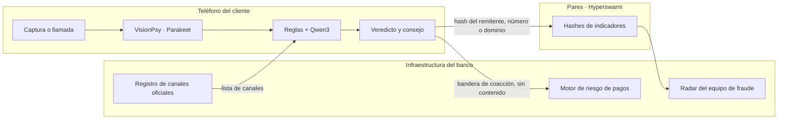

# Anti-fraude en el dispositivo · Hackatón QVAC · ISD Summit 2026

> Nombre del proyecto pendiente. Repositorio provisional: https://github.com/Andresssrr24/antifraude-qvac (privado hasta la entrega).

**Un motor anti-fraude que corre donde está el cliente.** No es una app más: es un motor que un banco, una cooperativa o una billetera de criptoactivos embebe en la suya. Lee la captura de un mensaje sospechoso o una llamada en vivo **en el teléfono del cliente**, con modelos locales de QVAC, y dice si es fraude, por qué y qué hacer. Ni el mensaje, ni la llamada, ni la captura salen nunca del dispositivo. Lo único que cruza una frontera es lo que no es inferencia: el registro de canales oficiales baja del emisor al teléfono, los reportes suben como hashes, y una bandera de coacción llega al motor de riesgo por el canal que la app del banco ya tiene.

| Superficie | Quién la usa | Dónde corre la inferencia |
|---|---|---|
| Módulo embebible en la app del emisor | El cliente | En su teléfono: VisionPsy y reglas |
| Radar para el equipo de fraude | El banco | En la infraestructura del banco |
| App de referencia, este repositorio | El jurado y el piloto | En el MacBook, con los mismos modelos |



El contrato de integración son dos esquemas JSON, `lib/esquemas.js`: lo que entra de la captura y lo que sale como veredicto. `npm run ejemplo` corre el motor sin interfaz y muestra exactamente lo que cruzaría hacia el banco. **Mismas tácticas, mismo motor:** las estafas contra usuarios de billeteras y exchanges piden la frase semilla, cambian direcciones de depósito y ofrecen «envíe para recibir»; el motor las detecta con las mismas reglas, y el set de demo incluye 16 ejemplos de una billetera ficticia.

Tracks en los que compite: **Desafío General**, **Caja de Ahorros**, **QVAC Psy**.

## Base preexistente

Declaración obligatoria del hackatón. Este proyecto parte de código ajeno:

- **Andamiaje de Electron, puente IPC, catálogo de modelos y patrón de extracción con esquema JSON** tomados de `qvac-invoice-manager-demo` en [tetherto/qvac-examples](https://github.com/tetherto/qvac-examples), licencia Apache-2.0, © QVAC by Tether. Archivos derivados: `main.js`, `preload.js`, `lib/modelos.js`, `lib/analizar.js`. Se recortaron y adaptaron; el texto original de la licencia está en `vendor-notice/`.
- **Patrones consultados** en `qvac-voice-relay` (transcripción) y `qvac-desk-tidy-demo` (embeddings) del mismo repositorio.
- Todo lo demás se escribió durante el hackatón: reglas, esquemas, generador de datos sintéticos, evaluación, pares, interfaz.

## Modelos y hardware declarados

| Tarea | Modelo | Constante del SDK | Cuantización |
|---|---|---|---|
| Leer la captura | VisionPsy Nano 460M Flash (modelo Psy) | `VISIONPSY_NANO_460M_MULTIMODAL_Q8_0` + proyector | Q8_0 |
| Veredicto y explicación | Qwen3 4B Instruct | `QWEN3_4B_INST_Q4_K_M` | Q4_K_M |
| Transcripción de llamadas | Parakeet TDT 0.6B v3 | `PARAKEET_TDT_0_6B_V3_Q8_0` | Q8_0 |
| Embeddings del RAG | EmbeddingGemma 300M | `EMBEDDINGGEMMA_300M_Q4_0` | Q4_0 |

Hardware de desarrollo y demo: MacBook con Apple M4 y 16 GB de RAM, macOS, backend GPU. SDK `@qvac/sdk` 0.19. Tiempos medidos en esta máquina: VisionPsy 1,06 s al primer token y 168 tokens/s; Qwen3 4B 2,33 s al primer token y 34 tokens/s con la política en el prompt. El objetivo del producto es el teléfono del cliente; los benchmarks de VisionPsy en teléfonos citados en la presentación son del fabricante del modelo, no medidos por este equipo **(pendiente: resultados propios si el Android con Expo llega)**.

## Reproducir

```bash
node -v                    # 22.17 o más
npx -y @qvac/cli doctor    # GPU, memoria, disco
npm install
node node_modules/electron/install.js   # si npm install no bajó el binario de Electron (pasa en redes lentas)
npm run modelos            # descarga los modelos a ~/.qvac/models (una vez, con internet)
npm run datos              # genera los mensajes sintéticos y renderiza las capturas
npm run prueba             # apaga el Wi-Fi primero: captura -> VisionPsy -> reglas -> veredicto de Qwen3
node scripts/prueba-llamada.js   # modo llamada sin interfaz sobre el audio sintético
npm run lint               # Biome
npm start                  # la app
npm run eval               # métricas sobre el set sintético -> eval/results.md
node eval/reglas-check.js  # chequeo de las reglas sin modelos
```

Después de descargar los modelos, la inferencia puede funcionar sin internet; P2P requiere conectividad entre equipos. La evaluación nueva guarda el rendimiento dentro del directorio de su corrida.

## Cómo funciona

1. **VisionPsy transcribe la captura** (`lib/analizar.js`, `extraerConVision`). Es el único modelo que mira la imagen. Se le pide una transcripción libre, línea por línea, que es lo que hace bien; no se le pide que rellene un esquema.
2. **Reglas deterministas derivan los campos** de esa transcripción (`lib/lector.js`, `derivar`): canal, remitente, enlaces, teléfonos y montos por expresiones regulares y posición, con reparación de enlaces partidos por el salto de línea.
3. **Reglas de fraude** (`lib/reglas.js`) producen evidencias en texto: dominio parecido al oficial, acortador, IP literal, punycode, número no oficial, petición de clave o código, presión de tiempo, pago a terceros. La presión de tiempo y la petición de datos se buscan sin tildes y tolerando una letra cambiada o de menos, porque VisionPsy transcribe «último aviso» o «dígame el código» con errores; un «no» o «nunca» delante del verbo anula la petición, para que «no lo comparta con nadie» siga siendo un consejo.
   **Segunda lectura con OCR**: cuando VisionPsy no encuentra señales, la misma imagen se lee con el OCR determinista; el OCR solo puede sumar señales de frase, petición de datos, urgencia o pagos, nunca de dominio ni de número, porque ensucia enlaces y convertía correos oficiales en fraude. Si VisionPsy leyó casi nada o las dos lecturas no coinciden en nada, el veredicto es «no legible» en vez de tranquilizar.
   **Contraste con OCR** (`Motor.contrastar`): solo en correos, y solo cuando una regla marca un dominio parecido al oficial, la misma imagen se lee con el OCR determinista del SDK (latin_g2 + CRAFT). Si el OCR ve el dominio oficial exacto y no ve el parecido, el fallo era de transcripción: el enlace se corrige y la señal desaparece. Si el OCR también ve el parecido, la señal se mantiene. Cuesta entre 7 y 9 s en un correo largo, por eso no corre en cada mensaje.
4. **Qwen3 4B** recibe la extracción y las evidencias y redacta el veredicto con un esquema JSON obligatorio: fraude, sospechoso, sin señales o no legible, con confianza, señales, acción y canal oficial. Nunca dice «seguro».
5. **Modo llamada** (`lib/llamada.js`). El audio se transcribe en el equipo por lotes de cinco segundos con **Parakeet TDT 0.6B v3**, y reglas deterministas sobre la ventana de los últimos veinte segundos disparan el aviso en el instante en que aparece una señal: pide el código, pide la clave, presiona con el tiempo, se presenta como el banco, pide un pago. El aviso llega con un mensaje fijo para el cliente, sin esperar a ningún modelo. Al terminar, Qwen3 4B resume la llamada en dos frases con un esquema JSON. En la app, la transcripción se muestra sincronizada con la reproducción del audio, así que se ve como en vivo aunque se procese por lotes.
6. **Política del banco como contexto** (`lib/politica.js`). La política anti-fraude sintética se parte en fragmentos y se indexa en el vector store del SDK con **EmbeddingGemma 300M**; en cada veredicto y en cada resumen de llamada se recuperan los tres fragmentos más cercanos y entran al prompt de Qwen3, que los usa para la acción y el canal oficial. Indexar cuesta unos 2 s la primera vez y cada búsqueda unos 10 ms.
7. **Pares** (`lib/pares.js`, `scripts/pares-worker.js`). Cuando un cliente reporta, solo viaja el hash del remitente, del número o del dominio, con el tipo y la hora. La capa de pares corre en un proceso hijo con **Hyperswarm**, el enjambre de Pear, sobre un tema fijo, y tiene un modo directo por TCP para redes que bloquean el DHT. Cada nodo conserva qué otros nodos reportaron cada indicador: si otro cliente ya reportó el mismo dominio o número, el teléfono lo dice antes del consejo. El radar del banco recibe lo mismo y lo muestra por hora. Como el proceso de pares es hijo aparte, el contador de la barra separa «nube» de «pares» con `lsof`: en la demo, nube cero.

### La decisión sobre el lector, con evidencia

Se probaron tres lectores sobre las mismas capturas sintéticas (`scripts/experimento-*.js`, `scripts/prueba-vision.js`, `scripts/prueba-lector.js`):

| Lector | Qué pasó | Tiempo por captura en el M4 |
|---|---|---|
| VisionPsy Flash con esquema JSON de ocho campos | Respeta la forma pero inventa el contenido: listas de enlaces con basura, «pide datos» casi siempre en true, texto parcial | 2 a 4 s |
| VisionPsy Flash en transcripción libre + reglas | Transcripción casi literal, remitentes y enlaces correctos, 15 de 15 veredictos por reglas en la muestra | TTFT 1,3 s · total 1,8 s |
| OCR clásico del SDK (latin_g2 + CRAFT) + reglas | Texto casi literal pero ensucia los enlaces («https:Il», «comlverificar») y tarda demasiado | 15 a 18 s |

Se eligió VisionPsy en transcripción libre. El OCR y la variante con esquema quedan disponibles con `LECTOR=ocr` y `LECTOR=visionpsy-esquema` para reproducir la comparación con `npm run eval`.

Una trampa que costó una hora y conviene contar: Electron recuerda el zoom por origen entre ejecuciones, y la segunda renderización de las capturas salió cortada por la mitad a la derecha. Los dos lectores «perdían el final de cada línea» y parecía culpa de los modelos. `data/render.js` fija el zoom en 1.

## Interfaz

Una ventana, dos mundos. A la izquierda, **lo que ve el cliente en su teléfono**: tema claro, letra grande, una acción por pantalla, veredicto en lenguaje llano («La dirección web imita la del banco», «Te meten prisa»), un botón para llamar al banco y otro para reportar. En el modo llamada, el aviso ocupa toda la pantalla: «Cuelga». A la derecha, **detrás de escena para el jurado y el banco**: tarjetas de ejemplo, los tres pasos con su tiempo (VisionPsy, reglas, Qwen3), las señales con su nombre técnico, la transcripción con marcas de tiempo y el JSON completo. La pestaña **Modo banco** es el radar del equipo de fraude.

Decisiones de diseño: sin framework, fuentes del sistema para funcionar sin internet, contraste mínimo 4,5:1, foco visible, `role="alert"` en el aviso de colgar, `aria-live` en la transcripción, movimiento reducido respetado, iconos SVG en vez de emojis. Para verificar la interfaz sin manos: `DEMO_AUTO=<id de captura>` o `DEMO_LLAMADA=1` junto con `DEMO_CAPTURA=<ruta.png>` guardan una imagen de la ventana.

## Cómo probarlo tú mismo

La guía completa, con solución de problemas, está en [docs/COMO-PROBAR.md](docs/COMO-PROBAR.md).

Todo corre en el MacBook. Dos procesos de QVAC a la vez se bloquean en el worker compartido, así que cierra cualquier script del proyecto antes de abrir la app, y al revés.

1. **Preparar una vez**, con internet: `npm install`, `node node_modules/electron/install.js` si no bajó Electron, y `npm run modelos`. Si el registro P2P del SDK se cae a mitad de Qwen3 4B, `node scripts/importar-modelo.js QWEN3_4B_INST_Q4_K_M <archivo .gguf bajado por HTTP>` lo importa validando el checksum.
2. **Datos de la demo:** `npm run datos` genera los 120 mensajes y sus capturas; `node data/generar-llamada.js` genera el audio de la llamada con las voces del sistema.
3. **Sin interfaz, para ver el motor:** `npm run prueba` analiza una captura de punta a punta; `node scripts/prueba-llamada.js` corre la llamada; `node scripts/prueba-politica.js` muestra qué recupera el RAG; `npm run eval` corre las 120 capturas y escribe `eval/results.md`.
4. **La app:** apaga el Wi-Fi y `npm start`. Pestaña Cliente: toca una tarjeta de ejemplo, o arrastra una captura, y mira el teléfono. «Simular llamada de vishing» reproduce el audio con la transcripción sincronizada y el «Cuelga». «Reportar este mensaje» publica el hash a los pares. Pestaña Modo banco: el radar. La barra dice cuántas conexiones hay a la nube y cuántas a pares.
5. **Pares en dos máquinas:** en la segunda, `node scripts/radar.js` se une al enjambre y va listando lo que llega. Si la red del lugar bloquea el DHT, modo directo: en la segunda máquina `node scripts/radar.js --puerto 4411 --sin-swarm`, y en la primera `PARES_DIRECTO=<ip de la segunda>:4411 npm start`. Para probarlo solo, en una terminal `node scripts/radar.js --puerto 4411 --sin-swarm --emitir dominio:bancodemo-pa.app` y en otra `PARES_DIRECTO=127.0.0.1:4411 PARES_SWARM=0 npm start`: al analizar la tarjeta «SMS: cuenta bloqueada» el teléfono dice que otro cliente ya reportó esa dirección.
6. **Comprobar sin manos:** `DEMO_AUTO=fraude-bloqueo_enlace-01 DEMO_CAPTURA=/tmp/app.png DEMO_SALIR=1 DEMO_ESPERA_MS=26000 npx electron .` analiza esa captura al abrir y guarda una imagen de la ventana; `DEMO_LLAMADA=1` hace lo mismo con la llamada.

Variables útiles: `LECTOR=ocr` o `LECTOR=visionpsy-esquema` cambian el lector para la comparación; `SIN_RAG=1` apaga la política; `PARES=0` apaga la capa de pares; `PARES_SWARM=0` deja solo el modo directo; `PARES_PUERTO=4411` hace que la app también escuche directo.

## App móvil y APK

La prueba de que el motor se embebe es una app Android con el mismo núcleo: código en `mobile/`, plan y mediciones en [docs/PLAN-APK.md](docs/PLAN-APK.md), instrucciones en [mobile/README.md](mobile/README.md). El APK está compilado: `mobile/dist/antifraude-release-arm64.apk`, 219 MB, arm64, Android 10 o superior, sin ningún modelo dentro; se comparte por enlace, no por el repositorio. Sin descargar nada, el usuario pega el texto de un mensaje y el veredicto sale de las reglas en menos de un milisegundo. Leer capturas descarga VisionPsy Q8 una sola vez (546 MB, el mismo lector del escritorio: Q4 se midió sobre las 136 capturas y pierde 4,4 puntos) y corre en el teléfono; el consejo en el teléfono es texto fijo por señal, porque Qwen3 0.6B, medido, no lo mejora y Qwen3 4B no cabe. El peso del APK es casi todo runtime del SDK: backend GPU Vulkan de 86 MB y runtime Bare de 62 MB; preferimos conservar la GPU antes que bajar a unos 133 MB. Estado: compilado en el MacBook sin Android Studio; la prueba en emulador arm64 está en curso y la prueba en teléfono físico queda para el equipo.

## Datos

Ningún dato real. El emisor de la demo es «Banco Demo»; las estafas de billetera imitan a «Billetera Demo», también ficticia. El audio de la llamada de vishing de la demo, `data/audio/llamada-vishing.wav`, es sintético: lo genera `data/generar-llamada.js` con las voces del sistema de macOS a partir del guion de `data/llamada-vishing.md`. Nadie fue grabado. Medido en el M4: cada lote de cinco segundos se transcribe en unos 150 ms, y la llamada completa de 45 s se procesa en unos 10 s con carga del modelo incluida. `data/banco-demo.json` define un banco ficticio con sus canales oficiales y los dominios parecidos que las reglas deben atrapar. `data/generar.js` produce mensajes de fraude y legítimos en español panameño con verdad conocida, y `data/render.js` los renderiza como capturas de SMS, WhatsApp y correo. Para un banco real se reemplaza el archivo del banco.

## Para el jurado de la Caja de Ahorros

**Aplicabilidad.** Es una función para la app del banco, no un producto aparte: «Verificar un mensaje» y «Verificar una llamada» dentro de la app que el cliente ya tiene. El mismo motor sirve en modo sucursal, para el cajero que recibe «¿este correo es de ustedes?». El radar le da al equipo de fraude las campañas contra la marca a medida que aparecen, con solo hashes.

**Lo local como ventaja, no como restricción.** Los mensajes y las llamadas privadas del cliente nunca llegan al banco ni a un proveedor, así que el banco no se vuelve custodio de datos que no quiere tener. El costo de inferencia por verificación es cero a cualquier escala. Funciona sin plan de datos, que es la realidad de muchos clientes. Y la trazabilidad que pide el regulador sale de los reportes, no de los mensajes.

**Demostración.** Cuatro ejemplos con un clic, la simulación de llamada con el aviso «Cuelga», el reporte que llega a otro equipo por pares, y el contador de conexiones a la nube en cero durante toda la demo.

**Piloto propuesto.** Noventa días con el equipo de fraude y un grupo de clientes, midiendo tres cosas: mensajes verificados, campañas detectadas antes que el centro de llamadas, y llamadas al centro evitadas.

## Para el reto QVAC Psy

**Por qué VisionPsy es central por necesidad.** La captura de pantalla permite al usuario aportar mensajes de distintas aplicaciones sin integrar cada servicio, y leerla en el teléfono exige un modelo de visión que quepa en un teléfono de gama media. VisionPsy Nano 460M Flash es el único modelo que mira la imagen en este flujo.

**Resultados históricos anteriores a la segunda lectura; deben repetirse para esta rama. Calidad medida sobre el set sintético** (`npm run eval`; la corrida reportada usó 120 capturas, y las 16 de billetera agregadas después entran en la próxima; resultados completos en `eval/results.md`, registro por llamada en `eval/perf.jsonl`):

| Métrica | Valor |
|---|---|
| Exactitud global del veredicto | 98,3% |
| Precisión en fraude | 100,0% |
| Exhaustividad en fraude | 96,9% |
| Legítimos reconocidos sin señales | 100,0% (48/48) |
| Mensajes con solo presión de tiempo reconocidos como sospechosos | 100,0% (8/8) |
| Remitente correcto (VisionPsy) | 85,8% |
| Dominios de los enlaces correctos (VisionPsy, tras el contraste) | 85,0% |
| Teléfonos correctos (VisionPsy) | 95,0% |
| Texto literal, 1 − CER medio (VisionPsy) | 73,9% |

| Etapa | TTFT mediana | Total mediana | Tokens/s | Tokens de salida |
|---|---|---|---|---|
| VisionPsy Flash, transcripción | 1,06 s | 1,81 s | 168 | 94 |
| Búsqueda en la política (EmbeddingGemma, vector store del SDK) | — | 29 ms | — | — |
| Contraste con OCR, solo en correos con dominio parecido (11 de 120) | — | 7,6 s | — | — |
| Qwen3 4B, veredicto con esquema y política | 2,33 s | 5,46 s | 34 | 102 |

Hardware: MacBook con Apple M4, 16 GB, backend GPU (Metal), `@qvac/sdk` 0.19. Cero errores de ejecución en las 120 capturas. Las corridas anteriores están en el historial del repositorio: 92,5 % con las reglas iniciales; 95,8 % con urgencia tolerante y política; 97,5 % con el contraste OCR; esta, con la petición de datos tolerante. La transcripción de VisionPsy no es determinista entre corridas, así que las cifras de extracción se mueven un par de puntos de una corrida a otra.

**Límites y manejo de riesgo, con honestidad.**
- La transcripción de VisionPsy tiene errores de caracteres (CER medio del 26,1 %), pero los campos que deciden el veredicto sobreviven porque las reglas trabajan sobre dominios, números y frases clave con tolerancia a errores, y porque un dominio dudoso en un correo se contrasta con el OCR determinista.
- Fallos de esta corrida, 2 de 120: fraude-pide_codigo-03: esperado fraude, obtenido sin_senales; fraude-pide_codigo-05: esperado fraude, obtenido sin_senales. Son mensajes que solo piden el código, sin enlace ni número, en los que la transcripción perdió a la vez el verbo y el dato; ningún legítimo se marcó como fraude. Ahí el techo lo pone la calidad de la transcripción, no las reglas.
- La app nunca dice «seguro». Ante la duda, muestra el canal oficial y pide llamar al número impreso en la tarjeta.

## Para el desafío general

**Problema.** Según los reportes de los bancos a la Superintendencia de Bancos de Panamá, en 2025 hubo intentos de fraude por canales electrónicos por unos 150 millones de dólares y fraudes materializados por unos 21 millones; el sector habla de siete panameños estafados al día, y el regulador alertó sobre esquemas que usan el nombre y el logo de los bancos. La víctima típica es una persona mayor con un mensaje o una llamada que la presiona.

**Por qué en el dispositivo.** La nube no debería llegar a los mensajes privados de nadie. La captura de pantalla es una entrada compartida para mensajes de distintas apps, y leerla exige un modelo de visión que quepa en un teléfono: VisionPsy Nano 460M. Todo lo demás, reglas, veredicto, transcripción de llamadas y política del banco, corre en el mismo equipo.

**Innovación.** El prototipo simula alertas durante una llamada procesada por lotes. Comparte indicadores reportados entre pares mediante Hyperswarm; su autenticidad requiere revisión y no demuestra inmunidad colectiva.

**Evidencia.** Evaluación reproducible sobre 120 capturas sintéticas con verdad conocida, registro de rendimiento por llamada al modelo, y una comparación honesta de tres lectores que dejó a VisionPsy transcribiendo y a las reglas derivando los campos.

## Seguridad y límites

- La app nunca dice «seguro». Dice «no encontré señales» y repite que el banco nunca pide claves ni códigos.
- La demo corre en escritorio. Los reportes transmiten hashes de indicadores, tipo, hora e identificador de nodo; no el mensaje. La interfaz y los registros locales deben revisarse antes de usar datos reales.
- Puede fallar con tácticas nuevas. Ante la duda, llamar al número oficial impreso en la tarjeta.

## Modelo de negocio

El propósito de la integración en el ecosistema bancario, con los puntos de integración, el caso de pagos, los límites y las fases de un piloto, está desarrollado en [docs/PROPOSITO-E-INTEGRACION.md](docs/PROPOSITO-E-INTEGRACION.md).

Lo que se vende es un módulo que el banco embebe en su app, con una consola para el equipo de fraude que corre dentro de la infraestructura del banco, y una app de marca blanca para cooperativas y financieras, que en Panamá son cientos y no tienen presupuesto de seguridad. Lo local es el argumento económico: costo de inferencia cero por verificación, y ningún dato del cliente en manos de un proveedor. La consola del banco, multiusuario y con histórico de campañas, es el producto que se construye después del hackatón con un stack web convencional; este repositorio es el motor local que la alimenta. La propiedad intelectual queda en el equipo, como establece el reto de la Caja.

Precios de partida, sin validar: para un banco, un pago inicial de integración y una mensualidad por tramo de clientes activos; para una cooperativa, una mensualidad baja por la app de marca blanca.

## Licencia

Apache-2.0. Ver `LICENSE` y `NOTICE`.

## Cambios de fiabilidad y alcance de la demo

La ausencia de señales en VisionPsy activa una segunda lectura OCR local. Si recupera una señal se usa para el veredicto; si falla, el texto es demasiado corto o los lectores discrepan, se pide revisión con `no_legible`. El generador no puede rebajar una alerta determinista. El umbral es heurístico, no una garantía: dos lectores pueden omitir la misma frase. Se añade latencia y debe medirse de nuevo.

`npm test` verifica estos flujos con dobles de los modelos. No sustituye la evaluación real. Ver [protocolo externo](docs/EVALUACION-INDEPENDIENTE.md) y [guion de entrega](docs/guion-video.md).

El radar marca reportes para investigación durante la sesión; no confirma fraude, no acredita usuarios únicos y no bloquea clientes. Los hashes sin secreto pueden compararse por enumeración y no son anonimización. El transporte directo TCP es únicamente para demostración con datos sintéticos en una red de confianza. El contador muestra conexiones TCP observadas, excluye UDP y no demuestra ausencia total de tráfico. Un fallo de medición se muestra como no disponible.
