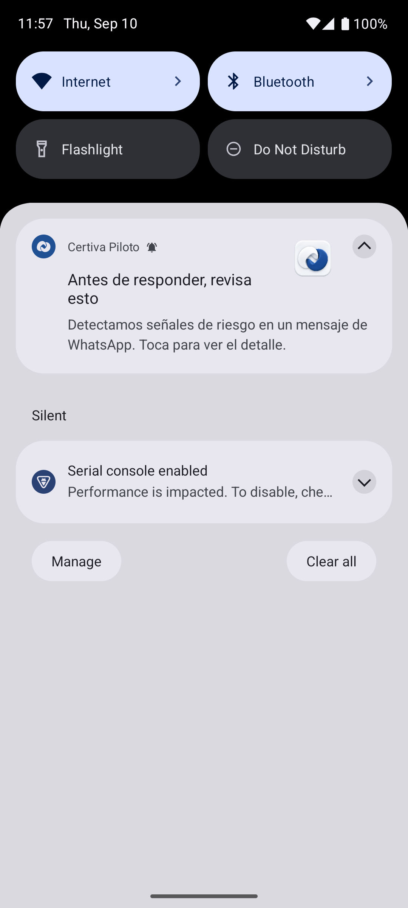
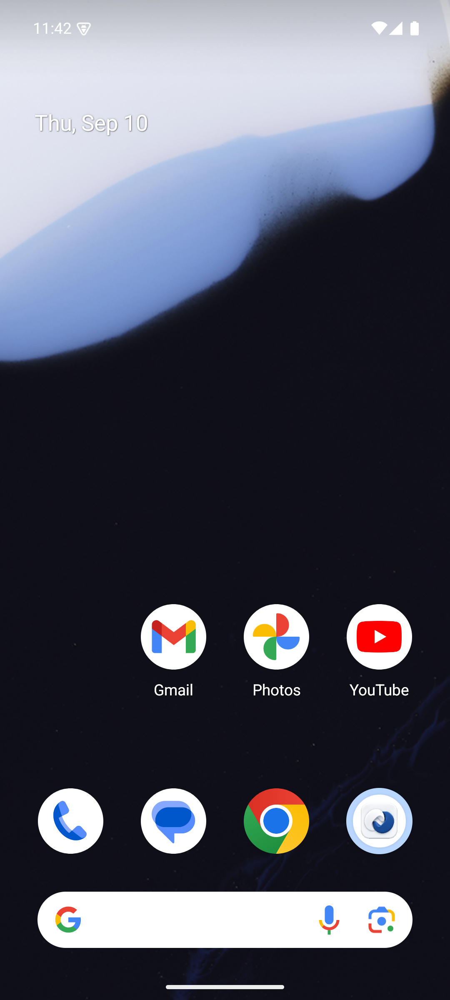

# Icono de Certiva para Android

El manifiesto de `pilot/android-app` declara `android:icon` y `android:roundIcon` con `@mipmap/ic_launcher`. El recurso adaptativo combina un fondo blanco con el símbolo Enlace de Certiva; el margen de 18 dp mantiene el contenedor cerámico dentro de la zona visible del lanzador.

El PNG está en `pilot/android-app/app/src/main/res/drawable-nodpi/certiva_launcher.png`. Deriva de la lámina aprobada `docs/marketing/brand/certiva-aplicaciones-azul-v5.png`, mediante la herramienta integrada ImageGen. Es una adaptación raster para la aplicación; la lámina v5 sigue siendo la referencia canónica de la marca.

## Instrucción de preparación

Extraer únicamente el icono grande de la firma superior izquierda: contenedor blanco de esquinas redondeadas y dos piezas curvas entrelazadas. Conservar orientación, abertura central, acabado cerámico y azul base #205094. Centrar en un lienzo cuadrado blanco, sin palabra, texto ni otros objetos, con márgenes iguales. No rediseñar ni simplificar el símbolo.

## Verificación

### Notificaciones

`ProtectionNotifications` usa `ic_certiva_notification.xml`, una adaptación vectorial monocroma del símbolo Enlace, como icono pequeño de las versiones privada y pública de la alerta. Android aplica el tinte del sistema a esta silueta. La alerta privada incluye además el PNG `certiva_launcher` como icono grande; el color de marca declarado es #205094.

Este cambio sustituye el candado genérico. Conserva el texto, los permisos, la privacidad y la apertura del detalle existentes. `:app:assembleDebug :app:lintDebug` pasó sobre la rama aislada en 30 segundos.

La comprobación visual en el emulador pasó: `NotificationBrandingTest`, 1 prueba en 4,028 segundos. Verificó el icono pequeño privado y público, la presencia del icono grande y el título visible; la captura revisada muestra ambas versiones de la marca. [Salida instrumentada](evidencias/notification-branding/instrumentation.txt) y [resultado con hash de APK](evidencias/notification-branding/result.json).

La prueba utilizó una notificación controlada en la APK de desarrollo 0.3, SHA-256 `cb69b6bfd72aada2c12649870b73fc6d73dd15f26707086c518913c185234837`: no acredita inferencia, entrega real de WhatsApp ni teléfono físico. La APK aislada de esta rama conserva la base `0.2.0-protection`, compiló correctamente y tiene SHA-256 `948c3767c576030e58b4c403b74da2b6a51c5ccda9fb26b5b31a14956a4efefe`; la prueba instrumentada citada no se ejecutó sobre ese segundo archivo.

### Lanzador

`./gradlew :app:processDebugResources --console=plain` pasó en la rama aislada del cambio: recursos y manifiesto Android compilados correctamente.

La APK de desarrollo vigente compiló con `:app:assembleDebug :app:assembleDebugAndroidTest :app:lintDebug` y se instaló correctamente en `emulator-5580`. Se verificó el icono en el dock de la pantalla principal y junto al nombre «Certiva Piloto» en el cajón de aplicaciones el 10 de septiembre de 2026, a las 23:43 (Panamá).

APK verificada: paquete `local.certiva.pilot`, versión de desarrollo `0.3.0-qvac-local`, SHA-256 `29a28001e4d9942241468653c17a09a39e8e18be652ea00e2b9b5ee6b0f750d3`. Esa APK contiene trabajo adicional en curso; la evidencia acredita la instalación del icono, no la validación del clasificador QVAC. La rama de este cambio solo incorpora recursos del lanzador y documentación sobre la base de Android 0.2 de `main`.
