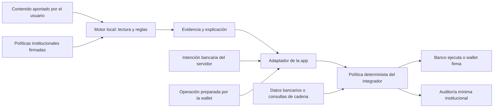

# Certiva: producto para banca panameña y wallets USDT

> HISTÓRICO. Bryan retiró USDT del alcance. La propuesta vigente es [PRODUCTO-BANCA-Y-MODELO-COMERCIAL.md](PRODUCTO-BANCA-Y-MODELO-COMERCIAL.md): SDK móvil, consola y distribución a clientes por un banco, con Caja de Ahorros como referencia. Los flujos y el backlog de cripto de este documento no son requisitos.

Fecha: 10 de septiembre de 2026. Propuesta de producto y arquitectura para revisión; no describe integraciones contratadas ni funcionalidades ya desplegadas. Marca: **Certiva · Tu aliado contra el fraude**. Campaña: **Antes de responder, verifica**.

## 1. Decisión de producto

Convertir Certiva en una capa de prevención de estafas integrada en aplicaciones financieras. Su trabajo es detectar señales de manipulación, explicar el riesgo y aportar evidencia antes de que el usuario entregue credenciales o autorice un pago.

Dos integraciones comerciales, con un núcleo compartido:

| Integración propuesta | Usuario y comprador | Momento de intervención | Resultado |
|---|---|---|---|
| Certiva para banca | Cliente de banca móvil; compran fraude y banca digital | Mensaje sospechoso, alta de beneficiario y antes del pago | Advertencia al cliente y señal verificable para la política del banco |
| Certiva para wallets | Usuario de wallet; compra el operador de la wallet | Antes de firmar una transferencia o autorización | Explicación del destinatario, activo, permisos y riesgos observables |
| Consola Certiva | Analistas de fraude y soporte de cada institución | Recepción e investigación de reportes | Casos, campañas, decisiones, auditoría y actualización de políticas |

La primera venta bancaria puede funcionar sin que el banco ofrezca cripto. La primera integración USDT puede funcionar sin cuentas en Caja de Ahorros. La conversión USD/USDT sería otro alcance, con proveedores, liquidez, conciliación y análisis jurídico propios.

## 2. Base disponible y brecha real

Revisión de `README.md`, `lib/seguridad.js`, `lib/pares.js`, `lib/reglas.js` y documentación del proyecto:

| Disponible en el prototipo | Falta para producción |
|---|---|
| Electron en Mac, lectura de capturas y reglas de fraude | SDK móvil, matriz de dispositivos y pruebas Android/iOS |
| QVAC local; explicaciones sujetas a un mínimo de protección determinista | Distribución de modelos firmados, actualización, rollback y evaluación independiente |
| Análisis de audio sintético por lotes | Validación de accesos permitidos al audio en cada plataforma y canal |
| Radar de reportes entre pares | Identidad de participantes, control de abuso, aislamiento institucional y gestión de casos |
| Banco ficticio y política de demostración | Registro de canales y políticas aprobado por cada banco |
| Evaluación sintética | Datos independientes representativos, métricas por segmento y seguimiento del piloto |
| No se identificó un adaptador USDT en el núcleo revisado | Decodificación de transacciones, contratos oficiales, proveedores de riesgo y enlace con la firma |

Las cifras históricas del dataset sintético no demuestran eficacia bancaria. Tampoco se ha probado aquí una integración móvil, una conexión al core bancario ni prevención de pérdidas reales.

## 3. Uso concreto en Caja de Ahorros

### Primer recorrido: verificar un mensaje

1. El cliente recibe un WhatsApp: «Tu cuenta será bloqueada, entra aquí».
2. Comparte una captura o pega el texto en «Verificar mensaje» dentro de la app bancaria.
3. Certiva extrae texto localmente y compara enlaces y solicitudes con reglas y un registro institucional firmado.
4. Muestra: «Este enlace se parece al del banco y te pide un código. No lo compartas».
5. Ofrece acceso a soporte desde la app o un contacto del registro aprobado, nunca del mensaje sospechoso.
6. El cliente puede reportar. Antes del envío ve los datos incluidos; el contenido privado no se adjunta por defecto.

La presencia de un dominio o teléfono oficial no autentica al remitente. La ausencia del registro tampoco demuestra fraude. El resultado debe distinguir indicios, autenticación y falta de información.

### Segundo recorrido: proteger una transferencia

Ejemplo ficticio: después de consultar un mensaje sospechoso, el cliente intenta enviar USD 850 a un beneficiario nuevo.

1. El servidor del banco crea una intención de pago con identificador, destinatario, importe y vencimiento.
2. El módulo aporta una señal reciente de posible manipulación, si existe y su tratamiento está autorizado.
3. El motor de riesgo combina esa evidencia con sus propios datos de sesión, beneficiario y comportamiento.
4. La política bancaria decide entre continuar con sus controles habituales, autenticación adicional, revisión o espera temporal.
5. El banco ejecuta el pago y conserva la decisión con su motivo y las versiones utilizadas.

Una señal del dispositivo es potencialmente manipulable: requiere procedencia, validación y límites. Nunca basta por sí sola para declarar fraude ni para sustituir los controles del banco. Un OTP adicional tampoco resuelve toda coacción: el estafador puede seguir guiando al cliente.

**Caja de Ahorros publica servicios de ACH, pagos a proveedores y planillas en su banca comercial. Esos flujos ofrecen puntos de integración posibles; la página revisada no demuestra que exista una API pública para Certiva.** La interfaz técnica se debe acordar con el banco. [Fuente oficial](https://www.cajadeahorros.com.pa/empresas/canales-digitales-empresariales/caja-en-linea-comercial/).

### Tercer recorrido: empresas y sucursales

- Una empresa recibe instrucciones para cambiar la cuenta de un proveedor. Certiva señala el cambio; el sistema bancario aplica confirmación independiente y doble autorización si su política lo exige.
- En sucursal, un asesor ayuda al cliente a revisar un mensaje aportado voluntariamente.
- Fraude agrupa reportes en campañas y tramita su investigación. Un reporte comunitario no se transforma automáticamente en un bloqueo.

Para presentar el piloto hacen falta responsables de fraude, banca digital, seguridad, privacidad, cumplimiento e integración. Caja de Ahorros es un prospecto de referencia, no un socio confirmado; cualquier uso comercial de su marca necesita el derecho correspondiente.

## 4. Uso concreto en wallets con USDT

### Recorrido antes de firmar

Ejemplo ficticio: el usuario pretende enviar 250 USDT a una dirección recibida por Telegram.

1. La wallet entrega la operación estructurada a Certiva, antes de solicitar la firma.
2. El adaptador comprueba red, contrato del activo, decimales, destinatario, importe y tipo de operación.
3. Compara el destinatario completo con la intención confirmada por el usuario. Una coincidencia parcial del inicio y final no acredita identidad.
4. Si hay conectividad, consulta estado de la red, simulación cuando esté soportada y proveedores de riesgo aprobados. Registra origen y antigüedad de cada resultado.
5. Explica: «Vas a enviar 250 USDT en esta red a esta dirección. Es un destinatario nuevo. No pudimos comprobar su reputación», o muestra las señales concretas encontradas.
6. La wallet aplica la política y solicita una confirmación informada. Al firmar, verifica que se trata de la misma operación evaluada.

Certiva no recibe semillas ni claves privadas. La firma permanece en la wallet. Los importes se representan como enteros en unidades mínimas, nunca con coma flotante.

### Coberturas iniciales

| Riesgo | Control propuesto | Límite que debe verse |
|---|---|---|
| Token falso llamado USDT | Validar contrato y red contra registro oficial versionado | El símbolo y el logo no prueban autenticidad |
| Destino cambiado o dirección visualmente parecida | Comparación de dirección completa y confirmación independiente | Una dirección nueva no es necesariamente maliciosa |
| Permiso de gasto excesivo | En redes compatibles, decodificar `approve`, identificar quién puede gastar y cuánto | Una autorización no es lo mismo que una transferencia |
| Firma o contrato desconocido | Decodificar tipos soportados y abstenerse ante contenido opaco | No presentar una simulación incompleta como verificación satisfactoria |
| Falso soporte solicitando recuperación | Analizar solicitudes de semilla, claves o pagos para desbloquear fondos | El usuario nunca debe introducir secretos en Certiva |
| Dirección reportada | Mostrar fuente, vigencia y contexto; revisión según política | Los reportes y el análisis de cadena pueden equivocarse |
| Red o reputación no disponible | Estado «verificación incompleta» y alternativa clara | Sin datos no equivale a bajo riesgo |

**Red inicial:** elegir una sola con la wallet piloto. Ethereum es una opción para validar transferencias ERC-20 y autorizaciones; TRON puede ser la prioridad si concentra el uso real del socio. Son adaptadores distintos y sus controles no deben confundirse. Tether publica ambos protocolos y sus identificadores oficiales. [Protocolos de Tether](https://tether.to/en/supported-protocols/).

No deducir soporte de una red porque una dirección tenga formato válido. La configuración debe fijar identificador de red, contrato y versión. Los tokens de prueba se identificarán como simulados, sin sugerir que constituyen USDT oficial.

### Quién puede detener la operación

- **Wallet custodial:** el operador puede retener una solicitud antes del envío conforme a su política y obligaciones.
- **Wallet de autocustodia integrada:** puede interrumpir su propio flujo de firma. No controla el uso de la misma clave desde otro software.
- **Operación emitida:** Certiva no puede prometer deshacerla o recuperar fondos. El seguimiento debe manejar pendiente, confirmada, fallida, reemplazada y reorganizaciones según la red.

Tether contempla acciones de congelamiento en determinadas circunstancias; eso no otorga a Certiva una facultad de congelar o recuperar USDT. [Documento del emisor, febrero de 2026](https://tether.to/public/Relevant_Information_Document_-_Tether_International%2C_S.A._de_C.V..pdf).

## 5. Arquitectura objetivo

**Núcleo local:** lectura, clasificación, señales explicables y abstención. El texto analizado es contenido no confiable: instrucciones dentro de una captura nunca pueden modificar políticas ni activar herramientas. El LLM redacta; las reglas y la política delimitan acciones.

**Servicio institucional:** distribución de configuración firmada, identidades, casos y auditoría. Despliegue dedicado o en infraestructura del socio según sus requisitos. Roles separados para analista, administrador de políticas y auditor; doble aprobación de cambios sensibles.

**Adaptador bancario:** sólo interfaces acordadas, usando entorno de pruebas y credenciales del integrador. No automatizar sesiones de banca en línea como sustituto de una integración.

**Adaptador wallet:** decodificación por red, consulta por proveedores permitidos y enlace entre intención, evaluación y firma. Toda modificación relevante invalida el resultado anterior.

### Contrato propuesto de evaluación

Campos mínimos: `assessment_id`, `tenant_id`, `intent_id`, `intent_digest`, `evaluated_at`, `expires_at`, `policy_version`, `rules_version`, `model_version`, `evidence[]`, `coverage`, `recommended_action`.

- `coverage`: `complete`, `partial`, `unavailable`, siempre dentro del alcance declarado. Incluso `complete` no certifica ausencia de fraude.
- `recommended_action`: `continue_standard_controls`, `warn`, `step_up`, `review`, `deny_by_policy`.
- Cada evidencia contiene código de motivo, procedencia, momento y estado de verificación.
- El servidor deriva la institución de la identidad autenticada; no confía en un `tenant_id` arbitrario del cliente.
- El digest se calcula sobre una serialización canónica que incluya todos los campos relevantes. La evaluación se vincula a identidad, intención, vencimiento y nonce; se verifica de nuevo inmediatamente antes de ejecutar o firmar.
- Idempotencia, prevención de repetición y autorización son controles separados. Una firma del dispositivo prueba procedencia, no veracidad de la observación.

**Caídas y desconexión:** la lectura puede funcionar localmente con modelos disponibles. Datos de reputación, políticas actualizadas y estado de cadena requieren conectividad. Si Certiva falla, el banco mantiene sus controles normales y aplica su contingencia aprobada; la wallet muestra la cobertura faltante. Una indisponibilidad no produce un resultado favorable ficticio.

## 6. Privacidad y operación en Panamá

El alcance normativo lo deben validar los responsables jurídicos y de cumplimiento del socio sobre el servicio concreto. La revisión pública identifica como bases la Ley 81 y su reglamentación, lineamientos bancarios de datos personales, banca electrónica y prevención de blanqueo. Esto no constituye una certificación ni una conclusión sobre habilitación para prestar servicios cripto.

| Base revisada | Trabajo de producto para el piloto |
|---|---|
| Ley 81 de 2019 y Decreto Ejecutivo 285 de 2021 | Inventario de tratamientos, base jurídica, finalidades, información al usuario, retención y atención de derechos |
| Acuerdo bancario 1-2022 sobre datos personales | Acordar responsabilidades entre banco y proveedor y los controles aplicables |
| Acuerdo 6-2011 de banca electrónica y modificaciones | Revisar integración, seguridad, autenticación, continuidad y evaluación independiente |
| Acuerdo 1-2026 de prevención del uso indebido de servicios bancarios y fiduciarios | Integrar con el programa del banco sin presentar el detector como sustituto de debida diligencia o monitoreo |

Fuentes: [ANTAI: reglamentación](https://antai.gob.pa/reglamentan-ley-81-de-proteccion-de-datos-personales/), [SBP: acuerdos bancarios y documentos compilados](https://www.superbancos.gob.pa/acuerdos/bancarios), [SBP: Acuerdo 1-2026](https://www.superbancos.gob.pa/documentos/leyes_y_regulaciones/acuerdos/2026/Acuerdo_01-2026.pdf).

Controles de diseño propuestos:

- No subir capturas, audio, contactos ni transcripciones por defecto. La aportación de evidencia a un caso es un flujo separado, informado y limitado.
- Una bandera de riesgo vinculada a un cliente puede ser dato personal, aunque no incluya el mensaje. Un hash de teléfono o dominio puede recuperarse por enumeración; no llamarlo anónimo.
- Deshabilitar el intercambio abierto entre pares en el perfil institucional inicial. Incorporar aislamiento, participantes autenticados, límites de reportes, caducidad y revisión antes de compartir inteligencia.
- Si se correlacionan indicadores, evaluar seudonimización con claves por institución y período, custodia de claves y resistencia a enumeración. HMAC no elimina automáticamente la condición de dato personal.
- Para tramitar la baja de un dominio hace falta evidencia utilizable y el dominio identificado: un hash aislado no basta. Su revelación requiere un flujo controlado.
- Establecer retenciones por clase de dato y obligación aplicable; no prometer eliminación inmediata de registros que el socio deba conservar.
- Las consultas a servicios de cadena pueden revelar una dirección y su contexto. Documentar destinatarios, jurisdicciones, retención y opciones de minimización.

La versión móvil inicial analizará contenido compartido deliberadamente. No prometer vigilancia de WhatsApp ni escucha continua de llamadas. Android restringe la captura de llamadas y Apple proporciona extensiones específicas, no acceso general a otras apps. [Android: audio compartido](https://developer.android.com/media/platform/sharing-audio-input), [Apple: extensiones](https://developer.apple.com/library/archive/documentation/General/Conceptual/ExtensibilityPG/).

## 7. Piloto de 90 días propuesto

Calendario contado desde disponibilidad del socio, responsables y entorno de pruebas; no incluye una promesa de contratación bancaria en 90 días. Rangos de participantes orientativos sujetos al diseño de evaluación.

| Etapa | Entregable | Condición para avanzar |
|---|---|---|
| Días 1–15 | Alcance firmado, mapa de datos, amenazas, registro de canales y criterios de evaluación | Dueños de riesgo y privacidad; contratos de integración; dataset de prueba reservado |
| Días 16–30 | SDK mínimo en una plataforma móvil y adaptadores simulados de banco/wallet | Pruebas de dispositivos, límites de cobertura, expiración y aislamiento |
| Días 31–60 | Piloto orientativo con 100–300 usuarios y revisión humana | Observación sin retención automática de pagos; medición de utilidad y falsos positivos |
| Días 61–90 | Intervención limitada aprobada por el socio | Revisión de seguridad superada, umbrales acordados y rollback ensayado |

Una wallet puede validar de forma independiente el adaptador de una red mientras la integración bancaria sigue su proceso. No hace falta que ambos socios estén listos para aprender de uno.

Métricas: recall de estafas por categoría; falsos positivos en mensajes y operaciones legítimos; abstenciones y consultas sin cobertura; latencia p50/p95 en dispositivos objetivo; sesiones sin fallos; finalización de tareas por usuarios; carga del analista; incidencias confirmadas. Reportar denominadores, tamaño de muestra e incertidumbre.

Objetivos iniciales para negociar, **no resultados medidos**: p95 de lectura menor a 5 s en dispositivos aprobados, reglas locales de transacción menores a 200 ms y disponibilidad mensual de servicios del piloto de 99,5 %. Medir aparte arranque en frío, descarga de modelos y consultas externas. Los umbrales de falsos positivos y detección se fijan antes del piloto con el socio según prevalencia y costo de error.

Para atribuir pérdidas evitadas o llamadas reducidas, definir línea base y grupo comparable sin retirar controles existentes. El importe de una transferencia cancelada no equivale automáticamente a dinero salvado.

## 8. Backlog verificable

| Prioridad | Trabajo | Criterio de aceptación |
|---|---|---|
| P0 | Extraer motor independiente de Electron | Ejecutable mediante interfaz documentada sin UI y con errores tipados |
| P0 | Política y registro de canales firmados | Rechazo de firma inválida, versión revocada o política vencida; rollback autorizado |
| P0 | SDK en una plataforma móvil | Prueba en dispositivos físicos con medición de RAM, batería, latencia y descarga interrumpida |
| P0 | Adaptador bancario de pruebas | El resultado no autoriza pagos; el simulador aplica política e invalida evaluaciones vencidas o alteradas |
| P0 | Adaptador USDT de una red | Rechaza contrato/red no admitidos; decodifica operaciones soportadas; usa enteros; falla explícitamente ante tipos desconocidos |
| P0 | Vincular revisión y ejecución | Cambiar destinatario, monto, red, permisos o intención exige nueva evaluación |
| P0 | Auditoría y aislamiento | Ninguna institución consulta casos ajenos; logs sin secretos ni contenido privado por defecto |
| P0 | Evaluación independiente | Dataset reservado con reportes de errores, abstenciones y desglose por categoría; sin reajuste sobre la prueba final |
| P1 | Consola de investigación | Asignación de casos, evidencia, estados, resolución y registro de acceso |
| P1 | Proveedor de riesgo de cadena | Fuente, cobertura, antigüedad y caída visibles; revisión de manejo de datos |
| P1 | Operación y seguridad | Pentest independiente, respuesta a incidentes, actualización firmada, SBOM y recuperación ensayada |
| P2 | Segunda plataforma y segunda red | Calidad validada de forma separada, sin extrapolar resultados de la primera |
| P2 | Inteligencia interinstitucional | Acuerdos, defensa contra reportes falsos y evaluación de privacidad antes de intercambio |

Pruebas de seguridad esenciales: inyección de instrucciones en una captura; reporte malicioso masivo; token falso; red distinta con dirección compatible; autorización ilimitada; transacción modificada tras revisión; reenvío de evaluación; reloj alterado; datos de reputación caducados; caída de proveedores y cruce de instituciones.

## 9. Modelo comercial y decisión de inversión

Vender un piloto pagado con alcance y criterios de salida; después, licencia anual por institución con niveles por usuarios protegidos o evaluaciones de transacciones, más integración y soporte. El comprador bancario obtiene protección del cliente, evidencia adicional para riesgo y menos trabajo manual si el piloto lo demuestra. La wallet obtiene una revisión comprensible en el momento de firmar.

No fijar precio definitivo antes de conocer usuarios activos, SLA, despliegue, redes y proveedores de riesgo. Costo mensual = infraestructura + datos externos + soporte + mantenimiento móvil/modelos + seguridad y auditorías. El procesamiento local puede reducir gasto en inferencia remota, pero no hace que la operación sea gratuita.

La próxima entrega implementable es **un mismo motor con dos flujos de pruebas: mensaje sospechoso → intención bancaria, y operación USDT → revisión previa a firma**, ambos con razones, cobertura y auditoría. La primera salida a clientes debe limitarse al flujo que supere evaluación móvil, seguridad y aceptación del socio.

## 10. Afirmaciones comerciales que deben quedar precisas

- «Procesa localmente el contenido compatible»; no «todo funciona offline» cuando intervienen reputación o consultas de cadena.
- «Ayuda a detectar señales de estafa»; no «certifica que una transacción sea segura».
- «Comparte los datos mínimos definidos para cada flujo»; no «los hashes son anónimos».
- «Integración propuesta para Caja de Ahorros» hasta contar con acuerdo real.
- «Reduce dependencia de inferencia remota»; no «costo total cero».
- «Resultados sobre datos sintéticos» para métricas del prototipo; reservar afirmaciones de producción para mediciones verificadas.

Este documento establece criterios para la siguiente etapa. Los documentos históricos del hackatón conservan su contexto; sus afirmaciones de anonimato, cobertura móvil o ahorro no deben trasladarse a una propuesta contractual sin estas precisiones.
