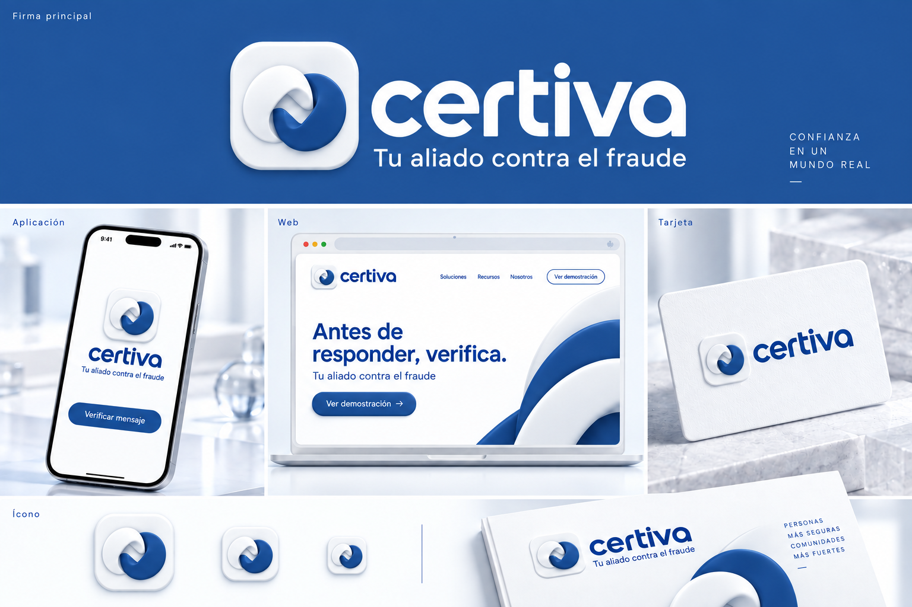

# Branding de Certiva

La referencia vigente aprobada es **v5**. Las exploraciones anteriores y el manual v1 se conservan como archivo histórico.

## Identidad vigente

- Nombre: **Certiva**; firma gráfica: **certiva**.
- Descriptor: **Tu aliado contra el fraude**.
- Campaña: **Antes de responder, verifica**.
- Símbolo: **03 · Enlace original**, dos piezas curvas entrelazadas, blanca arriba a la izquierda y azul abajo a la derecha.
- Azul base: **#205094**, RGB 32, 80, 148. Blanco: **#FFFFFF**.
- Firma compacta, lettering geométrico en minúsculas y glow sutil en bordes y detalles.

[Descargar referencia v5](certiva-aplicaciones-azul-v5.png). Las decisiones completas y los límites de uso están en [MEMORIA_PROYECTO.md](../../../MEMORIA_PROYECTO.md).

La lámina es una referencia visual de aplicaciones conceptuales. El master vectorial, la fuente exacta del lettering y las exportaciones finales siguen pendientes. No implica una relación comercial ni aprobación de Caja de Ahorros.

## Archivo histórico

| Material | Uso |
|---|---|
| [Referencia de selección del símbolo](certiva-referencia-aprobada.png) | Registro de la selección del Enlace 03; no sustituye la lámina v5 |
| [Símbolo inicial](certiva-enlace-icono-v1.png) | Exportación de la exploración inicial |
| [Kit v1](certiva-brand-kit-v1.png) | Primera propuesta |
| [Aplicaciones glow v2](certiva-aplicaciones-glow-v2.png) | Exploración de acabado |
| [Aplicaciones glow v3](certiva-aplicaciones-glow-v3.png) | Iteración de firma y descriptor |
| [Dirección v2](DIRECCION-V2.md) | Criterios históricos, sustituidos por v5 |
| [Aplicaciones v4](certiva-aplicaciones-azul-institucional-v4.png) | Aproximación anterior a la paleta final |
| [Paleta v4](PALETA-V4.md) | Antecedente de color |
| [Brand book v1 — histórico](Certiva-Brand-Book-v1-historico.pdf) | Manual inicial; su descriptor, tipografía y paleta no representan la identidad final |
| [Generador del manual v1](build_brandbook.py) | Fuente histórica; requiere ReportLab y Arial de macOS, escribe en `output/pdf/` |

Para piezas nuevas, usar siempre la referencia v5 y la memoria vigente.
